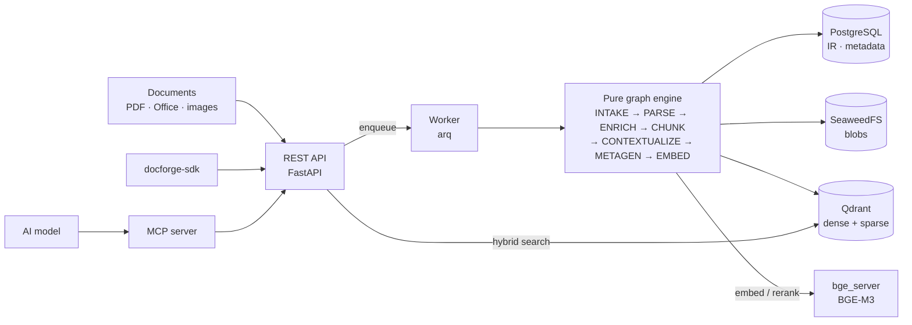

<div align="center">

<picture>
  <source media="(prefers-color-scheme: dark)" srcset="docs/assets/wordmark-reversed.svg" />
  
</picture>

### INGESTION, FORGED

**Document intelligence platform** — melt any document (PDF, Office, images…) into a canonical
intermediate representation, enrich it, chunk it, and serve **hybrid retrieval** over it.

[](https://pypi.org/project/docforge-sdk/)
[](https://pypi.org/project/docforge-sdk/)
[](https://github.com/Florian-BARRE/DocForge/actions/workflows/ci.yml)
[](LICENSE)

</div>

> **Multi-format → canonical IR → enrichment → structure-aware chunking → contextualization →
> generated metadata → BGE-M3 embeddings in Qdrant → hybrid search + optional cross-encoder rerank.**

DocForge ingests your documents once and makes them **queryable** — semantically (dense), lexically
(sparse), and by structured metadata — behind a clean REST API, a **typed Python SDK**, and an **MCP
server** that lets an AI model drive the whole platform.

---

## Why DocForge

- **The IR is canonical.** Markdown/PDF/HTML are generated *views*, never the source of truth — every
  downstream stage reads one normalized representation.
- **A pipeline is a pure graph.** Each node is `Config` + `Consume → Produce` with zero DB/S3 I/O; the
  worker persists only at the edges. Providers (parser, OCR, VLM, embed, LLM) are swappable — a new one
  is just another `kind` in its family, configured **per collection** (URL + secret live in the DB,
  never in `.env`).
- **A collection is a contract.** Its schema + ingestion pipeline + search config are validated
  **fail-fast at build time** (topology + config shape) before a cent of compute is spent.
- **Hybrid retrieval, first-class.** Named dense + sparse vectors in Qdrant, fusion, optional ColBERT
  cross-encoder rerank, and per-field **filterable / semantic / lexical** metadata surfaces.
- **Production-minded.** API-key auth (bearer, per-key capability + collection scoping, expiry &
  rotation), a fully-gated CI (format · lint · type · test · SDK↔API contract), and a published,
  drift-guarded SDK.

## Use it three ways

| | | |
|---|---|---|
| 🌐 **REST API** | FastAPI under `/api/v1`, interactive docs at `/scalar`. | [REST guide →](docs/rest-api.md) |
| 🐍 **Python SDK** | `pip install docforge-sdk` — typed **async + sync** client. | [SDK guide →](docs/python-sdk.md) |
| 🤖 **MCP (AI)** | Drive DocForge end-to-end from any AI model via MCP tools. | [MCP guide →](docs/mcp.md) |

```python
# The typed SDK — sync flavor
from docforge_sdk import Client

with Client(base_url="http://localhost:10040", api_token="df_...") as df:
    print(df.health.ping())
    for c in df.collections.list():
        print(c.name, len(c.fields), "fields")
```

---

## Architecture at a glance



Full detail: **[docs/architecture.md](docs/architecture.md)** · living pipeline reference:
**[src/docforge/PIPELINE.md](src/docforge/PIPELINE.md)**.

## Stack

| Layer | Choice |
|---|---|
| Runtime | Python 3.12 · FastAPI · Pydantic v2 · arq + Redis |
| Database | PostgreSQL 16 (SQLAlchemy 2 async + asyncpg + Alembic) |
| Object store | SeaweedFS (S3-compatible, aioboto3) |
| Vector DB | Qdrant (named dense + sparse) |
| Parse | Docling (default; MinerU/Marker escalation ready) |
| OCR / VLM | RapidOCR (local) · Mistral OCR (API) · VLM OpenAI-compatible (Qwen2.5-VL…) |
| Embed / rerank | BGE-M3 + BGE-reranker-v2-m3 via the local `bge_server` host |
| Conversion | Gotenberg (LibreOffice + Chromium) |
| Frontend | React + Vite |
| Containers | Docker + docker compose |

---

## Quickstart

> Requires Docker + docker compose v2. Full walkthrough: **[docs/getting-started.md](docs/getting-started.md)**.

```bash
# 1. Provision env from the templates (edit secrets before any real deployment)
cp services/docforge/.env.example         services/docforge/.env
cp services/docforge/postgres.env.example  services/docforge/postgres.env
cp services/docforge/s3_config.json.example services/docforge/s3_config.json
cp services/bge_server/.env.example              services/bge_server/.env

# 2. Start the full stack with hot reload (--profile full is MANDATORY)
docker compose -f docker-compose.yml -f docker-compose.dev.yml --profile full up --build -d

# 3. Apply database migrations
docker compose -f docker-compose.yml exec docforge_app \
  sh -c 'alembic -c /app/shared/alembic.ini upgrade head'
```

`bge_server` pulls BGE-M3 + the reranker from Hugging Face on first start (~few GB) — give it a couple
of minutes (`curl http://localhost:10047/health`). Then open:

- **API + interactive docs** → http://localhost:10040/scalar
- **Web UI** → http://localhost:10046

**Production** (baked images, data-plane ports closed):
`docker compose -f docker-compose.yml --profile full up -d` — read
**[docs/deployment.md](docs/deployment.md)** and **[docs/PROD-HARDENING.md](docs/PROD-HARDENING.md)** first.

---

## Documentation

| Guide | What's inside |
|---|---|
| **[Getting started](docs/getting-started.md)** | Install, run the stack, first collection → upload → search. |
| **[REST API](docs/rest-api.md)** | Every endpoint, auth, curl examples. |
| **[Python SDK](docs/python-sdk.md)** | `docforge-sdk` async + sync, per-resource reference. |
| **[MCP server](docs/mcp.md)** | Drive DocForge from an AI; the tool catalogue. |
| **[Architecture](docs/architecture.md)** | The graph engine, packages, retrieval, gates. |
| **[Configuration](docs/configuration.md)** | Every environment variable, per service. |
| **[Deployment](docs/deployment.md)** | Production hardening, ports, secrets, GPU. |
| **[Brand & design](docs/brand.md)** | The visual identity — palette, type, iconography, do/don't. |
| [Pipeline reference](src/docforge/PIPELINE.md) | The living deep-dive on the ingestion pipeline. |

## Repository layout

```
src/
  docforge/     # THE product (one uv project, 3 roots)
    shared/libs/       #   pure graph engine (pipelines/) · public IR models · Database façade
    app/               #   FastAPI backend (backend.*) + React frontend
    worker/            #   arq worker (runner + IR→DB persistence)
    migrations/        #   Alembic
  docforge_sdk/        # the published typed Python client (PyPI: docforge-sdk)
  mcp/                 # MCP server — exposes the API as AI tools (pure docforge-sdk client)
  bge_server/          # local BGE-M3 model host (dense + sparse embed + rerank)
services/              # per-service .env (gitignored) + .env.example templates
.github/workflows/     # gated CI (gate.yml) + PyPI release (release-sdk.yml)
```

Ports (dev): API `10040` · postgres `10041` · redis `10042` · qdrant `10043` · seaweedfs `10044` ·
gotenberg `10045` · frontend `10046` · bge_server `10047` · mcp `10048`.

## Development & contributing

Contributions welcome — see **[CONTRIBUTING.md](CONTRIBUTING.md)**. Every push runs the full gate
(`ruff format --check` · `ruff check` · `mypy` · unit tests) across all packages, the frontend build,
and an **SDK↔backend OpenAPI coherence check** — nothing merges (or publishes) unless it's all green.

```bash
cd src/docforge
uv run ruff format --check . && uv run ruff check .   # format + lint
uv run pytest tests/units -q                          # fast, fully mocked, no services needed
```

## License

The **DocForge platform** (this repository) is licensed under the **GNU GPLv3** — see [`LICENSE`](LICENSE).

The **`docforge-sdk`** client package is licensed under the permissive **MIT** license
(see [`src/docforge_sdk/LICENSE`](src/docforge_sdk/LICENSE)) so it can be freely embedded in any
application that talks to a DocForge instance.
