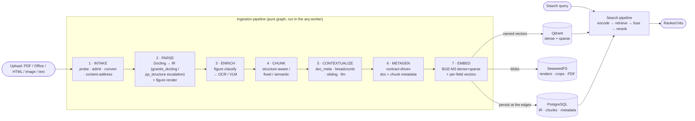
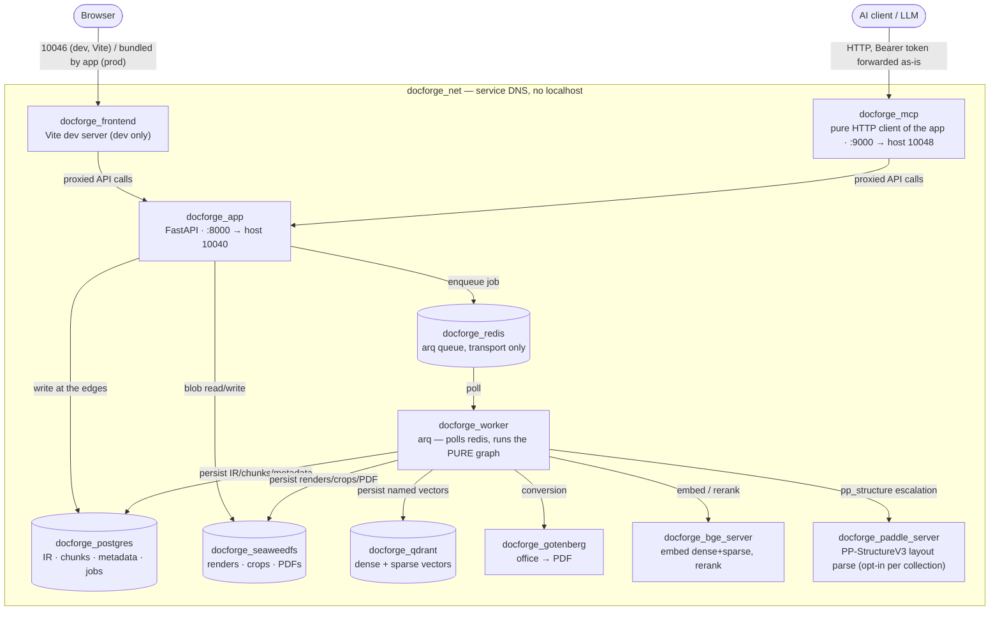
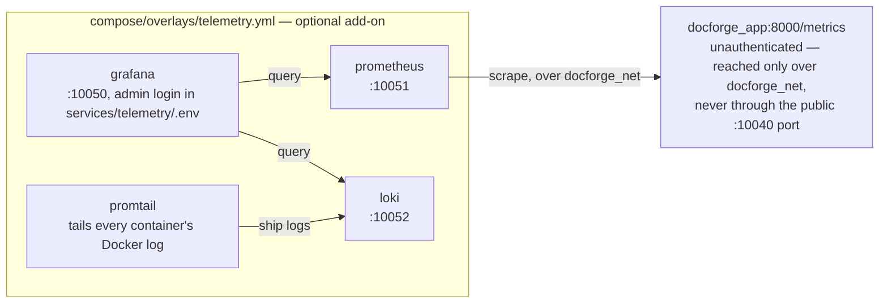

# DocForge Architecture

How DocForge is built: a document intelligence platform that turns any document into a canonical
**intermediate representation (IR)**, enriches and chunks it, generates metadata and embeddings, and
serves **hybrid retrieval** over it.

> **Related docs:** [Getting started](getting-started.md) · [REST API](rest-api.md) ·
> [Python SDK](python-sdk.md) · [MCP server](mcp.md) ·
> [Pipeline reference (living doc)](../src/docforge/PIPELINE.md)

---

## 1. Big picture

A document flows through **seven pipeline stages**, from raw bytes to indexed, searchable vectors.
The IR is canonical throughout — Markdown/PDF/HTML are generated *views*, never sources.



The engine hard-codes **no** pipeline: both ingestion and search are graphs of pure nodes run on the
same `FlowEngine`. See [`PIPELINE.md`](../src/docforge/PIPELINE.md) for the authoritative,
stage-by-stage reference.

---

## 2. Monorepo layout

DocForge is a monorepo of five packages plus per-service config.

```
src/
  docforge/     # THE product — FastAPI API + React frontend + arq worker + pure graph engine
    shared/libs/       #   pure graph engine (pipelines/), public IR models, Database façade (services/db)
    app/               #   FastAPI backend (backend.*) + React/Vite frontend (stage-rail studio)
    worker/            #   arq worker: runner (executes the pure pipeline) + IR→DB persistence
    migrations/        #   Alembic
    tests/units · tests/live
  docforge_sdk/        # the published, typed Python client (docforge-sdk on PyPI)
  mcp/                 # standalone MCP server — a pure HTTP client of the API (AI bridge)
  bge_server/          # local BGE-M3 embed/rerank host (TEI-compatible)
  paddle_server/       # PP-StructureV3 layout-parsing sidecar (POST /layout-parsing, GET /health)
services/              # per-service .env (gitignored) + .env.example templates
compose/               # per-scenario compose files (base + overlays + prod/dev × cpu/gpu) — see compose/README.md
docker-compose.yml     # thin root default: include: [compose/prod-cpu.yml]
```

**`docforge`** — the product itself, a single `uv` project with three roots. `shared/libs/`
holds the pure graph engine, the public IR models, and the `Database` façade over the data stores.
`app/` is the FastAPI backend (routers for pipelines, collections, documents, explorer, jobs, blobs)
plus the React frontend. `worker/` is the arq worker that executes the ingestion pipeline and
translates its IR output into database writes.

**`docforge_sdk`** — the published, typed client (`docforge-sdk`). It mirrors the REST surface as
resource objects (`collections`, `documents`, `explorer`, `search`, `jobs`, `blobs`, `pipelines`,
`transfers`, `snippets`, `corpus`, `audit`, `auth`, `health`) with Pydantic request/response models,
in both sync and async flavors. It is held
to the backend's OpenAPI contract by a CI coherence gate, so it can never drift from the API it
wraps.

**`mcp`** — the AI bridge. A thin MCP server that exposes the full REST surface as MCP tools by
wrapping `docforge-sdk`; an LLM connected to it can drive DocForge end to end. See [MCP docs](mcp.md).

**`bge_server`** — a self-managed model host serving BGE-M3 (dense + sparse embeddings) and
BGE-reranker-v2-m3, on a TEI-compatible contract. It owns its own image and GPU concerns; the
pipeline's `embed` node just calls it as one interchangeable provider.

**`paddle_server`** — a PP-StructureV3 (PaddleX) layout-parsing sidecar, mirroring `bge_server`:
`POST /layout-parsing` + `GET /health`, cpu/gpu image variants released to GHCR in the same workflow.
The pipeline's `pp_structure` parser node calls it as a network provider (in-network
`http://paddle_server:80`, dev-published on host port `10049`). It requires an AVX-capable CPU with
`enable_mkldnn=False` (handled) and a generous memory limit — PP-StructureV3 loads several models and
peaks a few GB. It stays OFF in every shipped blob, so the service being up costs idle memory only.

---

## 3. The graph engine

The heart of DocForge is a **pure graph engine** (`shared/libs/pipelines/`). A pipeline is a directed
graph of nodes; the engine executes it and the worker persists results only at the edges.

### Pure nodes

A node is **pure**: `Config` (a `NodeConfig`, `extra="forbid"`) + **Consume → Produce**, with **zero
DB/S3 I/O**. It declares typed input/output slots (each an `Artifact` or `list[Artifact]`, each with
a required description), its `family`/`kind`, and flags like `UNIQUE_IN_GRAPH`, `scored`, and
`switch_fields`. Persistence happens at the edges, in the worker, via the `Database` façade — never
inside a node. A node may *read* through an injected read-only capability, but never writes.

### The seven ingestion stages

| # | Stage | What it does |
|---|---|---|
| 1 | **INTAKE** | Probe the true format from content, admit against the collection contract (format/size/metadata), convert to PDF (Gotenberg), probe the PDF, content-address the original bytes (sha256). |
| 2 | **PARSE** | Docling (default) parses into a complete `DocumentIR` (blocks, tables, figures, bbox, heading tree, quality score); `figure_render` embeds each figure's PNG crop into the IR. `ScoreBelow` escalation heads are wired: `granite_docling` (Docling's Granite VLM pipeline, in-worker, same IR mapper) and `pp_structure` (PP-StructureV3 over the PaddleX sidecar). |
| 3 | **ENRICH** | Extract figures, then a `ForEach` classifies each and routes it (switch) to OCR or VLM per class; `enrich_apply` folds the results back into the IR. |
| 4 | **CHUNK** | One chunker (family choice): `structure_aware`, `fixed_size`, or `semantic`. |
| 5 | **CONTEXTUALIZE** | Stackable methods that enrich chunk text: `doc_meta`, `breadcrumb`, `sliding` window, `llm`. |
| 6 | **METAGEN** | Contract-driven metadata generation for document and chunk, LLM + prompt per field, structured output. |
| 7 | **EMBED** | One embed provider (family choice): `bge_server` (dense + sparse) or any OpenAI-compatible endpoint (dense), plus named vectors per semantic metadata field. |

### Flow primitives

- **Transitions** (control flow): `OnSuccess` (default) · `OnFailure` (recovery/escalation) ·
  `ScoreBelow(threshold)` (quality escalation) · `WhenEquals(field, value)` (the switch) · `Always`.
  Selection priority: `ScoreBelow > WhenEquals > OnSuccess/OnFailure > Always`.
- **Bindings** (data flow): `FromRunInput` · `FromNode(node, field)` (any upstream node) ·
  `FromGroupInput` · `FromFirst(candidates)` (convergence join after a branch).
- **`ForEach`**: a sub-graph per item (`over` / `item_field` / `max_concurrency`); every body
  terminal produces the same `Artifact`, so the output is an ordered `list[T]`.
- **Families** (the UI palette, `kind`s with no redundancy): stage families `intake · converter ·
  parser · render · enrich · chunker · contextualize · metagen`, plus generic capabilities `embed ·
  ocr · vlm · llm · structgen`. A new provider is just one more `kind` in its family — interchangeable
  in the UI, nothing changes in the engine.
- **Fallback chains**: every standard-interface call (`parser`/`ocr`/`vlm`/`embed`/`llm`/`structgen`)
  is an externalized chain — providers as nodes + fallback transitions converging on `FromFirst`
  (best-first). A single provider is a one-step chain. `parser` is a real fallback family like the
  rest: `docling` (default) escalates via `ScoreBelow` to `granite_docling` / `pp_structure`.

### Collection = contract, fail-fast at build

A **collection is a contract**. When a pipeline blob is written or built, the `GraphValidator` runs a
**structural** fail-fast — single entry, no cycles, no ambiguous fan-out, all upstream bindings
present and type-compatible, `ScoreBelow` only above a `scored` producer, uniqueness of single-use
nodes — **before any compute is spent**. Config is `extra="forbid"`, so a typo in a blob fails the
build rather than being silently ignored. A broken blob comes back as **data** (`valid=false` +
`issues`, or `build_error`), never as an HTTP 500.

Validation is honestly scoped: it checks topology and config shape, **not connectivity**. A wrong or
unreachable `base_url`/`api_key` builds cleanly and fails at **run** (surfaced by `job.error` naming
the offending node). A per-provider `preflight()` (`WORKER_PREFLIGHT_ENABLED`, **on by default** —
safe because the stock pipeline ships its provider-hosted stages OFF) checks reachability before the
first spend.

Every network node inherits a **shared timeout/retry surface** (`TimeoutConfig`: `timeout_seconds`,
`preflight_timeout_seconds` — plus `TimeoutRetryConfig`: `max_retries`, `retry_backoff_seconds` for
retrying nodes), tuned **per collection in the blob**. The whole ingest job is additionally bounded by
a per-collection `job_timeout_seconds` (nullable; NULL falls back to the worker's
`WORKER_JOB_TIMEOUT_SECONDS`). The collection identity + limits (including `job_timeout_seconds`) are
exposed as a JSON Schema by `GET /api/v1/collections/contract-schema` — the same mechanism as a node's
`config_schema` — and the UI renders it via `SchemaForm`, so new contract fields surface automatically.

### Two pipeline kinds, one engine

The `PipelineRegistry` maps `key → façade`: **`ingest`** runs async in the worker; **`search`** runs
**inline** in the API request (sub-second, no arq) via an app-side `SearchRunner`. Each collection
carries two symmetric blobs — `collection.pipeline` (ingest) and `collection.search` — each validated
at write in fail-fast. The search validator additionally enforces a **terminal contract**: an exit
must produce a `SearchResult`, or the write is rejected `422`.

---

## 4. Storage & stack

| Layer | Choice | Role |
|---|---|---|
| Runtime | Python 3.12 · FastAPI · Pydantic v2 | API + pure engine |
| Worker | **arq + Redis** | Async ingestion jobs; per-node execution trace |
| Relational | **PostgreSQL 16** (SQLAlchemy 2 async + asyncpg + Alembic) | Canonical IR, chunks, rich metadata, collections, jobs, API keys |
| Vectors | **Qdrant** | Named dense + sparse vectors; lean filterable payload |
| Object store | **SeaweedFS** (S3-compatible, aioboto3) | Content-addressed blobs: page renders, figure crops, canonical PDF, original upload |
| Parse | **Docling** (default) · **Granite-Docling** VLM (in-worker) · **PP-StructureV3** (PaddleX `paddle_server` sidecar) — `ScoreBelow` escalation heads | Document → IR |
| OCR / VLM | RapidOCR (local) · Mistral OCR (API) · OpenAI-compatible VLM (Qwen2.5-VL…) | Figure/text enrichment |
| Embed / rerank | **BGE-M3** + BGE-reranker-v2-m3 via `src/bge_server`, or any OpenAI-compatible endpoint | Dense + sparse embeddings, cross-encoder rerank |
| Conversion | **Gotenberg** (LibreOffice + Chromium) | Any format → PDF |
| Hashing | sha256 (content-addressing) · blake3 (cache fingerprints) | |
| Frontend | React + Vite | Stage-rail pipeline studio + headless API |
| Containers | Docker + docker compose | |

The engine is **pure**: nodes never touch these stores. All I/O is a **façade** in
`shared/libs/services/db/facades/` (auth · collections · documents · ingestion · jobs · metagen ·
search), called by the worker or a router — never from a node. Providers (URL + secret) live **per
collection in the DB**, never in `.env`, so they are swappable within a family without redeploying.

A read-only **storage-footprint** surface (`GET /api/v1/collections/{id}/storage`, the
`StorageFootprintFacade`) reports how much hardware a collection occupies across these three stores:
**S3/SeaweedFS bytes are exact** (from the content-addressed blob registry — a blob shared across
documents counts once), while **PostgreSQL and Qdrant bytes are estimates** (real in-tuple row bytes
via `pg_column_size`, excluding index/TOAST; Qdrant dense/sparse/payload from point counts and a
sample, on-disk float32 excluding the HNSW index). It returns per-store totals, a `grand_total_bytes`
(deduped-physical S3 + PG + Qdrant) and a heaviest-first per-document breakdown; the collection
Overview UI renders it as a panel. It is also reachable through the typed SDK
(`client.collections.storage(id)`) and the MCP `collection_storage_footprint` tool.

---

## 5. Retrieval

Search is **hybrid** and runs inline in the request as its own pure graph (`encode → retrieve → fuse
→ rerank → postprocess`):

- **Dense + sparse fusion** — Qdrant stores named dense and sparse (BM25-style) vectors; both are
  queried and their results fused.
- **Optional cross-encoder rerank** — a BGE-reranker (cross-encoder) re-scores the fused candidates
  when enabled, served by `bge_server`.
- **Per-field metadata surfaces** — every metadata field carries three orthogonal flags that drive
  everything: **`filterable`** (→ Qdrant payload, exact / any-of filter), **`semantic`** (→ named
  dense vector `meta_<slug>_dense`), **`lexical`** (→ sparse vector `meta_<slug>_bm25`).
  Document-scope values are **denormalized onto every chunk point** (via best-effort post-index hooks
  plus a backfill repair job — never failing a persisted ingestion, and never re-embedding content).
- **Search targets** — a `SearchTarget` (`{field, semantic, lexical}`) picks *which* named vectors to
  query (chunk `content` and/or metadata fields, up to metadata-only). Naming a non-indexed vector is
  a fail-fast `422`.

---

## 6. Quality gates

Nothing merges or publishes unless the whole monorepo is green. A **single reusable gate**
(`.github/workflows/gate.yml`) is called by CI (main pushes + every PR) and by BOTH release workflows
(`release-images.yml` and `release-sdk.yml`) — so what merges and what publishes are held to the exact
same bar. The unit suites are serviceless (every store mocked); the ONE exception is the `db-tests`
job, which spins a throwaway `postgres:16` service for the `-m db` suite. No docker image builds and no
`-m live` tests run in CI.

The gate covers **every package**:

- **`docforge`** — ruff format + lint + the mocked unit suite, plus a `db-tests` job running the
  `-m db` suite against a throwaway `postgres:16` service.
- **`docforge_sdk`** and **`mcp`** — ruff format + lint + **mypy** + unit tests.
- **`bge_server`** — ruff format + lint + mypy + tests (CPU-only torch wheel).
- **frontend** — ESLint (`react-hooks/rules-of-hooks` is an error) + `tsc --noEmit` + vitest render
  smoke tests + Vite build.
- **`sdk-parity`** — an **SDK↔backend OpenAPI coherence gate**: it dumps the backend's current
  OpenAPI (serviceless) and fails red if the `docforge-sdk` models or committed snapshot drift from
  it. SDK/backend drift can never merge — nor publish.

---

## 7. Deployment topology & service interactions

All containers share one Docker bridge network, `docforge_net` — services address each other by
**service DNS name** (`docforge_app`, `docforge_postgres`, `bge_server`, `paddle_server`, …), never
`localhost`. In prod, only the app, worker-adjacent tools (gotenberg), frontend, and MCP publish host
ports; the data stores (`postgres`, `redis`, `qdrant`, `seaweedfs`) stay internal-only. See
`compose/README.md` for the full scenario/overlay matrix and the port table in
[`docs/configuration.md`](configuration.md).



The worker never talks to the frontend or MCP — it only consumes jobs off Redis and writes results
at the edges (Postgres/Qdrant/SeaweedFS), through the same `Database` façade the API uses. `gotenberg`,
`bge_server`, and `paddle_server` are called as interchangeable **providers** (base URL + secret live
per collection in the DB, not in `.env`); `paddle_server` in particular ships OFF in every stock
pipeline blob, so its container being up costs idle memory only until a collection opts a `pp_structure`
node in.

### Optional telemetry add-on

Metrics/logs are **not** part of the core stack — they are an opt-in overlay,
`compose/overlays/telemetry.yml`, layered with a plain `-f` on top of any scenario and **not gated by
`--profile full`** (its four containers start unconditionally whenever the overlay is included).



`prometheus` scrapes `/metrics` on the internal network specifically because that endpoint is
**unauthenticated** by design (`METRICS_ENABLED`, see [`docs/configuration.md`](configuration.md)) —
routing the scrape through `docforge_net` instead of the published host port keeps it off any public
interface. `promtail` discovers containers via the read-only Docker socket and tails their JSON-file
logs into `loki`; `grafana` is provisioned with both datasources plus a starter dashboard (request
rate, p95 latency, error rate, arq queue depth, job counts, live workers).
