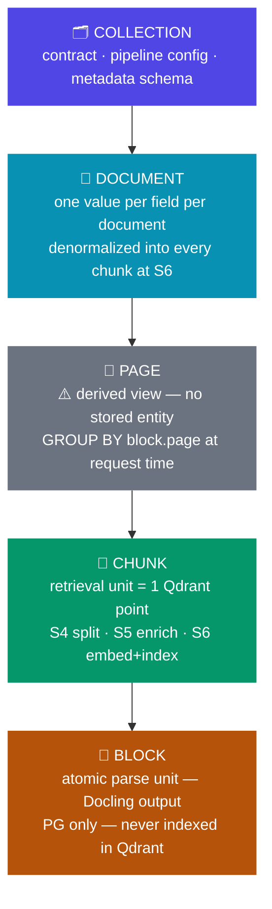
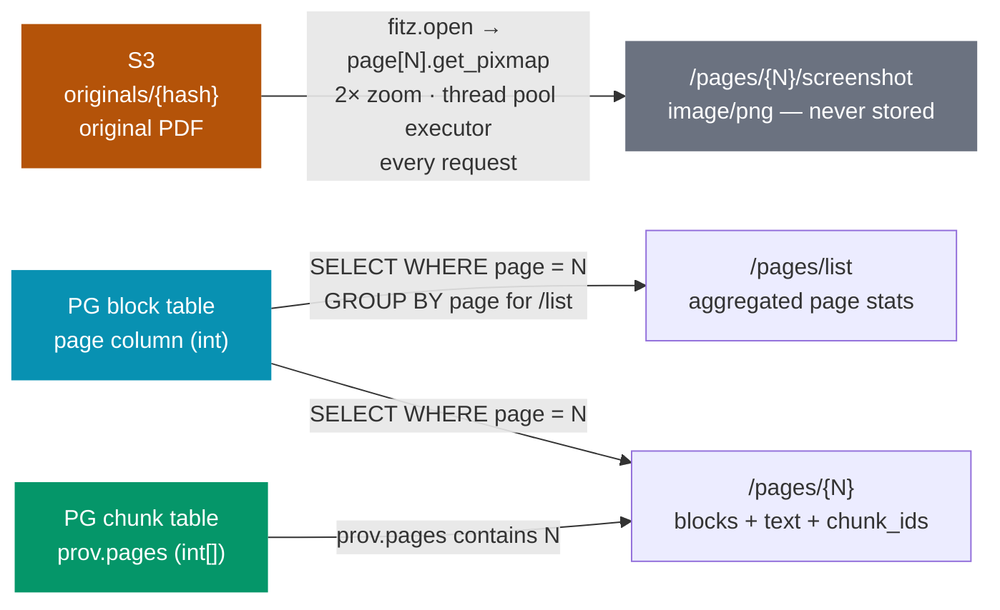
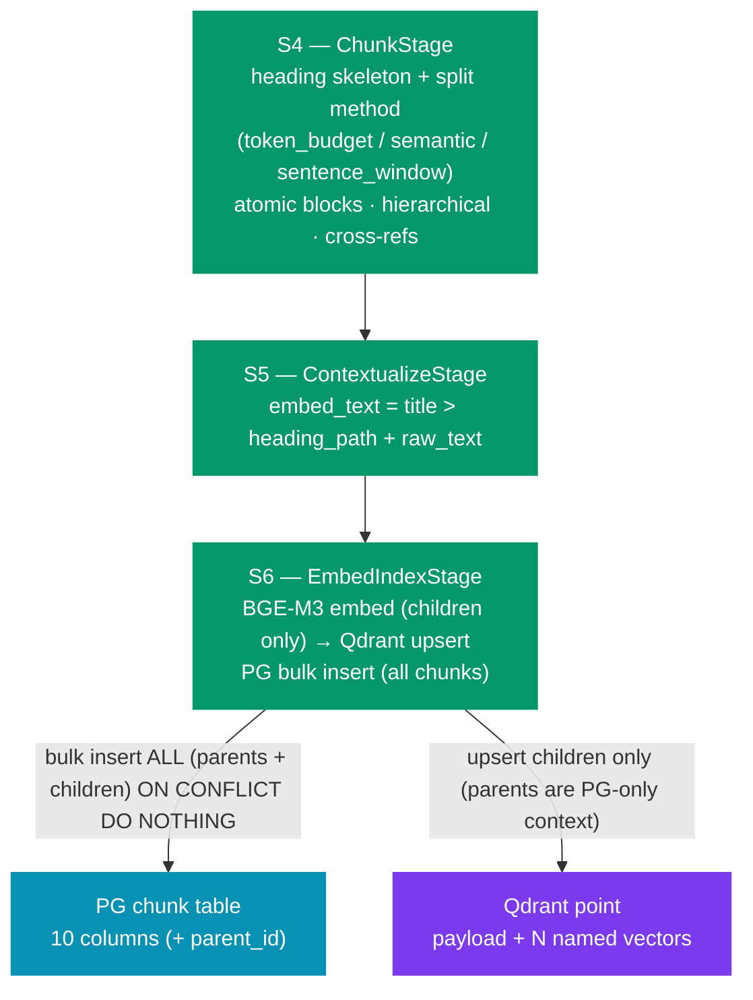
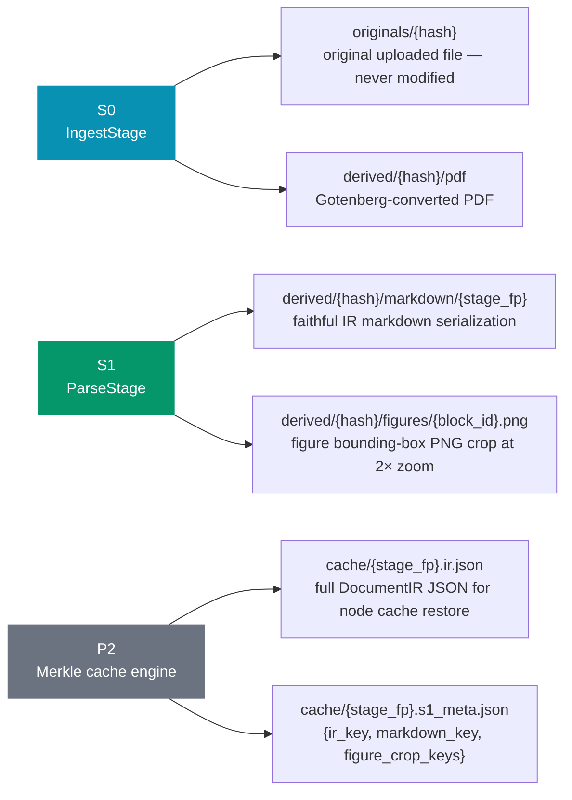
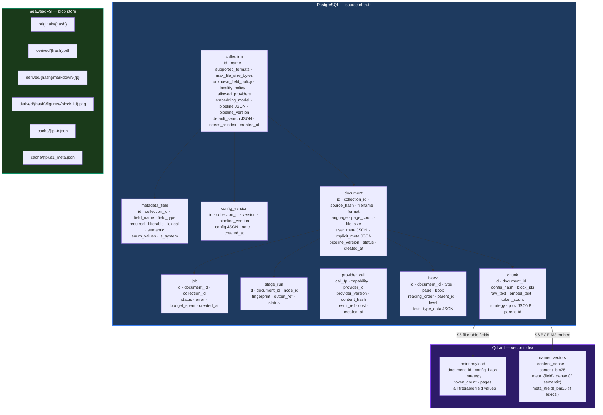

# DocForge — Metadata & Storage Architecture

Complete reference for every field, table, blob and Qdrant vector in the system.
Organized from coarsest (collection) to finest (block) granularity.

---

## Storage layer legend

| Badge | Layer | Notes |
|---|---|---|
| `PG` | PostgreSQL table column | Source of truth — durable, always authoritative |
| `Q-payload` | Qdrant point payload | Filterable in vector search queries |
| `Q-vec` | Qdrant named vector | Searchable — dense (semantic) or sparse BM25 (lexical) |
| `S3` | SeaweedFS blob | Content-addressed on `source_hash` (blake3) |
| `FLY` | Computed on request | Nothing stored — derived at call time from stored data |

---

## Granularity hierarchy

---

## 📋 Récap complet — toutes les métadonnées par hiérarchie

Tableau de contrôle unique, de la granularité la plus large (collection) à la plus fine (chunk).
**PG est toujours la source de vérité** ; Qdrant ne reçoit que des copies dénormalisées par chunk,
au stage S6, selon les flags du champ. `—` = absent de cette couche.

| Niveau | Métadonnée | Origine (set by) | PG — emplacement | Qdrant — emplacement | Notes |
|---|---|---|---|---|---|
| **Collection** | `id` | admission | `collection.id` | = **nom de la collection Qdrant** | 1 collection DocForge ↔ 1 collection Qdrant |
| **Collection** | `name` | admission | `collection.name` | — | unique |
| **Collection** | `supported_formats` | admission | `collection.supported_formats` | — | contrat d'admission |
| **Collection** | `max_file_size_bytes` | admission | `collection.max_file_size_bytes` | — | contrat d'admission |
| **Collection** | `locality_policy` | admission | `collection.locality_policy` | — | gate providers cloud |
| **Collection** | `unknown_field_policy` | admission | `collection.unknown_field_policy` | — | `reject`/`ignore`/`store` |
| **Collection** | `embedding_model` | admission | `collection.embedding_model` | **fixe la dimension/espace** des vecteurs | changer ⇒ `needs_reindex` |
| **Collection** | `pipeline` (PipelineConfig) | admission/config | `collection.pipeline` JSONB | — | influe sur tout l'indexing en aval |
| **Collection** | `pipeline_version` | config_repo | `collection.pipeline_version` | `Q-payload.config_hash` (indirect, par chunk) | bump à chaque update |
| **Collection** | `needs_reindex` | config_repo | `collection.needs_reindex` | — | flag de réindexation |
| **Collection** | définitions de champs | admission/config | `metadata_field` (1 ligne/champ) | — | **définit** le routage des valeurs (voir combinaisons) |
| **Collection** | historique config | config_repo | `config_version` | — | snapshots |
| **Document** | `id` | admission | `document.id` | `Q-payload.document_id` (chaque chunk) | filtre par document |
| **Document** | `collection_id` | admission | `document.collection_id` | — (implicite via collection Qdrant) | |
| **Document** | `source_hash` | S0 | `document.source_hash` + `implicit_meta` | — | clé content-address S3 |
| **Document** | `filename` | S0 | `document.filename` + `implicit_meta` | `Q-payload` + `Q-vec meta_filename_bm25` | champ système (filterable+lexical) |
| **Document** | `extension` | S0 | `implicit_meta.extension` | `Q-payload` | champ système (filterable) |
| **Document** | `file_size` | S0 | `document.file_size` + `implicit_meta` | `Q-payload` | champ système (filterable) |
| **Document** | `has_scanned_pages` | S0 | `implicit_meta.has_scanned_pages` | `Q-payload` | champ système (filterable) |
| **Document** | `format` | S0 | `document.format` = `implicit_meta.extension` | `Q-payload` (via le champ système `extension`) | **filtrable** — même valeur que `extension` (format/extension d'origine, ex. `pdf`/`docx`) ; pas de champ `format` distinct pour éviter un doublon |
| **Document** | `language` | S1 (py3langid) | `document.language` + `doc_meta` | `Q-payload` | champ système **filterable** — détecté hors-ligne sur le texte parsé (ISO 639-1, ex. `fr`/`en`), fallback `und` si non fiable |
| **Document** | `page_count` | S1 | `document.page_count` + `implicit_meta` | `Q-payload` | champ système dérivé (filterable) |
| **Document** | `n_blocks` | S1 | `implicit_meta` / doc_meta | `Q-payload` | champ système dérivé (filterable) |
| **Document** | `n_figures` | S1 | doc_meta | `Q-payload` | champ système dérivé (filterable) |
| **Document** | `n_tables` | S1 | doc_meta | `Q-payload` | champ système dérivé (filterable) |
| **Document** | fingerprints / stats pipeline | S0–S2 | `implicit_meta` (s0/s1/s2_fingerprint, ir_key, markdown_key, budget_spent, ocr_calls, vlm_calls…) | — | audit/cache only |
| **Document** | **champ user `{f}`** | admission (`user_metadata`) | `document.user_meta.{f}` | **selon flags** → voir tableau combinaisons ci-dessous | même valeur sur tous les chunks du doc |
| **Document** | `status` | worker | `document.status` | — | cycle de vie |
| **Document** | `pipeline_version` (doc) | admission | `document.pipeline_version` | — | version active à l'ingest |
| **Page** | liste blocs / texte page | S1 | dérivé de `block.page` | — | `FLY` (requête) |
| **Page** | n_blocks/figures/tables (page) | — | agrégat sur `block` | — | `FLY` DERIVED |
| **Page** | `page` (n° de page) | S4 | `chunk.prov.pages` | `Q-payload.pages` + champ système `page` (`Q-payload`) | chunk-level, résolu de `prov.pages[0]` |
| **Page** | screenshot PNG | — | — (S3 = PDF original) | — | `FLY` — jamais stocké, rendu à la volée |
| **Chunk** | `id` | S4 | `chunk.id` | **= Qdrant point id** | identité stable |
| **Chunk** | `document_id` | S4 | `chunk.document_id` | `Q-payload.document_id` | |
| **Chunk** | `config_hash` | S4 | `chunk.config_hash` | `Q-payload.config_hash` | clé d'invalidation cache |
| **Chunk** | `block_ids` | S4 | `chunk.block_ids` + `prov` | — | provenance blocs |
| **Chunk** | `raw_text` | S4 | `chunk.raw_text` | — | texte fidèle (affiché/cité) ; **non vectorisé directement** |
| **Chunk** | `embed_text` | S5 | `chunk.embed_text` | — (vectorisé puis jeté) | `title > heading_path + raw_text` ; **source de `content_dense` ET `content_bm25`** |
| **Chunk** | `token_count` | S4 | `chunk.token_count` | `Q-payload.token_count` + champ système `token_count` | filterable |
| **Chunk** | `strategy` | S4 | `chunk.strategy` | `Q-payload.strategy` | `token_budget`/`semantic`/`sentence_window`/`figure`/`table`/`section_parent` |
| **Chunk** | `parent_id` | S4 | `chunk.parent_id` (self-FK) | `Q-payload.parent_id` (enfants seulement) | hiérarchique : parent persisté PG, **non indexé Qdrant** |
| **Chunk** | `prov.pages` | S4 | `chunk.prov.pages` | `Q-payload.pages` | int[] pages couvertes |
| **Chunk** | `prov.heading_path` | S4 | `chunk.prov.heading_path` | champ système `heading_path` → `Q-payload` + `Q-vec meta_heading_path_dense` | filterable+semantic |
| **Chunk** | `prov.block_types` | S4 | `chunk.prov.block_types` | champ système `block_type` → `Q-payload` | filterable |
| **Chunk** | `prov.linked_chunk_ids` | S4 (Axe 4) | `chunk.prov.linked_chunk_ids` | — | cross-références (best-effort) |
| **Chunk** | **corps du chunk (toujours)** | S6 | — | `Q-vec content_dense` + `Q-vec content_bm25` | présents sur **chaque** point, indépendants des champs |

> **Bloc** (niveau le plus fin) : unité atomique Docling, stockée en PG (`block` table) — **jamais** indexée dans Qdrant. Voir Level 5 plus bas.

### Champ métadonnée user/système — ce que change chaque combinaison de flags

Un champ déclaré dans le schéma porte 3 flags **orthogonaux et cumulables** : `filterable`, `lexical`,
`semantic`. **La valeur est toujours en PG** (`document.user_meta` pour les champs document, `chunk.prov`
pour les champs chunk) ; les flags décident uniquement de ce qui est **copié/vectorisé dans Qdrant** par chunk.

| `filterable` | `lexical` | `semantic` | PG (valeur) | `Q-payload` | `Q-vec meta_{f}_dense` | `Q-vec meta_{f}_bm25` | Effet retrieval |
|:---:|:---:|:---:|:---:|:---:|:---:|:---:|---|
| ❌ | ❌ | ❌ | ✅ | — | — | — | **PG only** — ni filtre ni recherche ; visible seulement via API document/chunk (affichage/audit) |
| ✅ | ❌ | ❌ | ✅ | ✅ | — | — | Filtrable (égalité/range) ; aucun scoring |
| ❌ | ✅ | ❌ | ✅ | — | — | ✅ | Recherche **lexicale** BM25 dédiée (fusion RRF) ; non filtrable |
| ❌ | ❌ | ✅ | ✅ | — | ✅ | — | Recherche **sémantique** dense dédiée (fusion RRF) ; non filtrable |
| ✅ | ✅ | ❌ | ✅ | ✅ | — | ✅ | Filtrable **+** recherche lexicale |
| ✅ | ❌ | ✅ | ✅ | ✅ | ✅ | — | Filtrable **+** recherche sémantique |
| ❌ | ✅ | ✅ | ✅ | — | ✅ | ✅ | Recherche **hybride** (dense+lexicale) sur le champ ; non filtrable |
| ✅ | ✅ | ✅ | ✅ | ✅ | ✅ | ✅ | Filtrable **+** hybride complet — couverture maximale |

> Les poids de fusion `weight_lexical` / `weight_semantic` ne s'appliquent que lorsque `lexical` / `semantic`
> sont activés (override possible par requête via `weight_overrides`). `meta_{f}_*` est le nom de vecteur
> nommé Qdrant dérivé du nom de champ slugifié (`field_dense_name` / `field_sparse_name`).

---

## Level 1 — COLLECTION

Not part of the `metadata_fields` indexing system.
These are the collection contract, pipeline config, and schema definition.

### Table `collection`

| Column | Type | Storage | Description |
|---|---|---|---|
| `id` | UUID PK | `PG` | Collection identifier |
| `name` | string(255) unique | `PG` | Human-readable name |
| `supported_formats` | string[] | `PG` | Accepted MIME/extensions e.g. `["pdf", "docx", "html", "pptx", "xlsx"]` |
| `max_file_size_bytes` | int | `PG` | Upload size cap in bytes |
| `unknown_field_policy` | string(30) | `PG` | `"ignore"` or `"reject"` — what to do with caller-provided fields not in the schema |
| `locality_policy` | string(30) | `PG` | `"local_only"` or `"external_allowed"` — whether cloud API providers are permitted |
| `allowed_providers` | string[] | `PG` | Explicit provider allowlist; empty array = all providers allowed |
| `embedding_model` | string(255) | `PG` | BGE-M3 model identifier — changing it sets `needs_reindex=True` |
| `pipeline` | JSON | `PG` | Serialized `PipelineConfig` (see below) |
| `pipeline_version` | string(64) | `PG` | Bumped on every `config/update` (e.g. `"v1"`, `"v2"`) |
| `default_search` | JSON | `PG` | Default search parameters applied when caller omits them |
| `needs_reindex` | bool | `PG` | `True` when embedding_model changed — existing vectors are stale until reindex |
| `created_at` | timestamp tz | `PG` | Creation timestamp |

### `pipeline` JSON — `PipelineConfig` structure

| Key path | Type | Default | Description |
|---|---|---|---|
| `parse.provider.id` | string | `"docling"` | Parser backend: `"docling"` · `"mineru"` · `"marker"` · `"tika"` |
| `parse.provider.params` | dict | `{}` | Provider-specific parameters |
| `enrich.classifier.id` | string | `"layout_labels"` | Figure classifier: `"layout_labels"` (heuristic) · `"vit_onnx"` (ViT model) |
| `enrich.classifier.params` | dict | `{}` | Classifier parameters |
| `enrich.ocr_chain` | list[{id, params}] | `[]` | OCR escalation chain in order, e.g. `[{id:"paddle_ocr"}, {id:"mistral_ocr"}]` |
| `enrich.vlm.id` | string \| null | `null` | VLM provider: `"openai_compat"` or null to disable VLM |
| `enrich.vlm.params` | dict | `{}` | VLM parameters (endpoint, model, max_tokens…) |
| `chunk.split_method.id` | string | `"token_budget"` | Intra-section split method (decision tree): `"token_budget"` · `"semantic"` (BGE-M3/TEI embeddings) · `"sentence_window"` |
| `chunk.split_method.params` | dict | `{}` | Method-specific params. token_budget: `max_tokens`, `overlap_blocks`. semantic: `max_tokens`, `min_tokens`, `breakpoint_percentile`, `base_url`. sentence_window: `window_sentences`, `stride_sentences`, `max_tokens` |
| `chunk.hierarchical` | bool | `false` | Emit a parent chunk per divided section over its children; children are searched, the parent (`section_parent`) is returned for context |
| `chunk.atomic.tables` | bool | `true` | Keep a table whole as its own chunk (never split / folded) |
| `chunk.atomic.figures` | bool | `true` | Keep a figure (OCR + description + chart data) as its own chunk |
| `chunk.atomic.formulas` | bool | `true` | Never separate a formula from its introducing block |
| `chunk.atomic.keep_caption_with_figure` | bool | `true` | Fold an adjacent caption into its figure/table chunk |
| `chunk.cross_references` | bool | `true` | Detect "see Figure 3 / Article 5" and record the target in `prov.linked_chunk_ids` |
| `chunk.merge_short_sections` | bool | `true` | Pack tiny sibling sections together — no title-only chunks (flat mode) |
| `chunk.contextualize` | bool | `true` | Run S5 to build `embed_text` from title + section breadcrumb + body |
| `chunk.reinject_breadcrumb` | bool | `true` | Prepend `heading_path` to `embed_text` for section awareness |
| `chunk.heading_rules` | list[{pattern, level}] | DEFAULT_HEADING_RULES | Regex rules to detect custom heading levels (applied on top of the parser) |
| `embed.provider.id` | string | `"tei_bge_m3"` | Embedding backend (selectable provider, like every ML brick). S6 has no on/off switch — embedding is always part of retrieval, gated only by the deployment's `S6_ENABLED` infra flag |
| `embed.provider.params` | dict | `{}` | Provider params: `base_url` (TEI endpoint — local container or external host), `model` (model served by the endpoint), `api_key` (optional, for a secured/hosted endpoint) |

### Table `metadata_field` — one row per field per collection

| Column | Type | Storage | Description |
|---|---|---|---|
| `id` | int PK autoincrement | `PG` | Internal row id |
| `collection_id` | UUID FK | `PG` | Owning collection |
| `field_name` | string(255) | `PG` | Field identifier, e.g. `"filename"`, `"project_code"` |
| `field_type` | string(30) | `PG` | `"string"` · `"number"` · `"date"` · `"bool"` · `"enum"` · `"string[]"` |
| `required` | bool | `PG` | If `True`, ingest rejected when field absent from `user_metadata` |
| `filterable` | bool | `PG` | If `True`, value promoted to Qdrant payload (exact/range filter) |
| `lexical` | bool | `PG` | If `True`, named sparse BM25 vector `meta_{field}_bm25` created in Qdrant |
| `semantic` | bool | `PG` | If `True`, named dense BGE-M3 vector `meta_{field}_dense` created in Qdrant |
| `enum_values` | string[] \| null | `PG` | Allowed values when `field_type = "enum"` |
| `is_system` | bool | `PG` | `True` for auto-extracted system fields; `False` for caller-defined custom fields |

### Table `config_version` — config history

| Column | Type | Storage | Description |
|---|---|---|---|
| `id` | UUID PK | `PG` | Version snapshot identifier |
| `collection_id` | UUID FK | `PG` | Owning collection |
| `version` | int | `PG` | Monotonically increasing version number |
| `pipeline_version` | string(64) | `PG` | Collection `pipeline_version` at snapshot time |
| `config` | JSON | `PG` | Full collection config snapshot (supported_formats, pipeline, metadata_fields, …) |
| `note` | string(255) \| null | `PG` | Optional human note on the config change |
| `created_at` | timestamp tz | `PG` | Snapshot timestamp |

---

## Level 2 — DOCUMENT

### Table `document`

One row per ingested file. Document-level metadata is denormalized into every chunk at S6 time
because Qdrant has no document entity — each Qdrant point = one chunk.

| Column | Type | Storage | Set by | Description |
|---|---|---|---|---|
| `id` | UUID PK | `PG` | admission | Document identifier |
| `collection_id` | UUID FK | `PG` | admission | Owning collection |
| `source_hash` | string(64) | `PG` | S0 | blake3 of original file content — content-addressable S3 key |
| `filename` | string(512) | `PG` | S0 | Original filename as uploaded |
| `format` | string(32) | `PG` | S0 | Detected format e.g. `"pdf"`, `"docx"` |
| `language` | string(10) \| null | `PG` | S1 | ISO 639-1 language code e.g. `"fr"`, `"en"` — detected offline by py3langid on the parsed text (fallback `"und"`); exposed as a **filterable** system metadata field |
| `page_count` | int \| null | `PG` | S1 | Total pages after parsing — null until S1 completes |
| `file_size` | int | `PG` | S0 | File size in bytes |
| `user_meta` | JSON | `PG` | admission | Caller-provided custom metadata from the ingest request |
| `implicit_meta` | JSON | `PG` | S0 | System-computed: `{filename, extension, file_size, source_hash, page_count, has_scanned_pages}` |
| `pipeline_version` | string(64) | `PG` | admission | Collection `pipeline_version` active at ingest time |
| `status` | string(20) | `PG` | worker | `"pending"` · `"running"` · `"done"` · `"error"` |
| `created_at` | timestamp tz | `PG` | admission | Ingestion request timestamp |

### System metadata fields — file-intrinsic (S0)

Values come from `implicit_meta` and are denormalized into every chunk at S6.

| Field name | `field_type` | `filterable` | `lexical` | `semantic` | Storage |
|---|---|:---:|:---:|:---:|---|
| `filename` | string | ✅ | ✅ | ❌ | `PG` implicit_meta · `Q-payload` · `Q-vec` BM25 |
| `extension` | string | ✅ | ❌ | ❌ | `PG` implicit_meta · `Q-payload` |
| `file_size` | number | ✅ | ❌ | ❌ | `PG` implicit_meta · `Q-payload` |
| `has_scanned_pages` | bool | ✅ | ❌ | ❌ | `PG` implicit_meta · `Q-payload` |

### System metadata fields — document-derived (S1, after parsing)

Computed from the parsed `DocumentIR`. Denormalized into every chunk.

| Field name | `field_type` | `filterable` | Storage | Resolved from |
|---|---|:---:|---|---|
| `language` | string | ✅ | `PG` document.language + doc_meta · `Q-payload` | py3langid over the parsed IR text (fallback `"und"`) |
| `page_count` | number | ✅ | `PG` doc_meta · `Q-payload` | `ir.n_pages` |
| `n_blocks` | number | ✅ | `PG` doc_meta · `Q-payload` | `len(ir.blocks)` |
| `n_figures` | number | ✅ | `PG` doc_meta · `Q-payload` | `len(ir.figure_blocks)` |
| `n_tables` | number | ✅ | `PG` doc_meta · `Q-payload` | `len(ir.table_blocks)` |

### Custom caller-provided metadata

Provided at ingest in `user_metadata`. Same value on all chunks of the document.
Storage depends on the flags declared on the field in the collection schema.

| Flags on the field | Where stored |
|---|---|
| none (`filterable=False`, `lexical=False`, `semantic=False`) | `PG` `document.user_meta` only — never indexed |
| `filterable=True` | `PG` user_meta · `Q-payload` |
| `lexical=True` | `PG` user_meta · `Q-vec` sparse BM25 `meta_{field}_bm25` |
| `semantic=True` | `PG` user_meta · `Q-vec` dense BGE-M3 `meta_{field}_dense` |

Flags are orthogonal and cumulative — a field can carry all three simultaneously.

### Table `job` — pipeline execution tracking

| Column | Type | Storage | Description |
|---|---|---|---|
| `id` | UUID PK | `PG` | Job identifier |
| `document_id` | UUID FK | `PG` | Document being processed |
| `collection_id` | UUID | `PG` | Owning collection |
| `status` | string(20) | `PG` | `"pending"` · `"running"` · `"done"` · `"failed"` |
| `error` | text \| null | `PG` | Error message if `status = "failed"` |
| `budget_spent` | float | `PG` | Cumulative OCR/VLM API cost in USD |
| `created_at` | timestamp tz | `PG` | Job creation timestamp |

### P2 cache tables

#### Table `stage_run` — Merkle-DAG node cache

| Column | Type | Storage | Description |
|---|---|---|---|
| `id` | int PK | `PG` | Row id |
| `document_id` | UUID FK | `PG` | Owning document |
| `node_id` | string(64) | `PG` | Stage name e.g. `"s1_parse"` |
| `fingerprint` | string(128) | `PG` | Merkle-DAG fingerprint of this node's inputs |
| `output_ref` | string(512) \| null | `PG` | S3 key of the cached stage output JSON |
| `status` | string(20) | `PG` | `"pending"` · `"done"` |

#### Table `provider_call` — provider result cache

| Column | Type | Storage | Description |
|---|---|---|---|
| `call_fp` | string(128) PK | `PG` | blake3(capability, provider_id, version, params, content_hash) |
| `capability` | string(64) | `PG` | e.g. `"ocr"`, `"vlm"`, `"embed"` |
| `provider_id` | string(128) | `PG` | e.g. `"mistral_ocr"`, `"paddle_ocr"` |
| `provider_version` | string(64) | `PG` | Provider version string |
| `content_hash` | string(128) | `PG` | blake3 of the input content |
| `result_ref` | string(512) \| null | `PG` | S3 key of the cached result JSON |
| `cost` | float | `PG` | API cost in USD for this call |
| `created_at` | timestamp tz | `PG` | Call timestamp |

---

## Level 3 — PAGE *(derived view — no stored entity)*

| Data | How obtained | Storage |
|---|---|---|
| Block list for page N | `SELECT * FROM block WHERE document_id = ? AND page = N ORDER BY reading_order` | `FLY` query |
| Page text | Concatenation of `block.text` for blocks on that page, in reading order | `FLY` DERIVED |
| n_blocks, n_figures, n_tables on page | Aggregate over filtered blocks | `FLY` DERIVED |
| Chunk IDs covering page N | Chunks where `prov["pages"]` contains N | `FLY` query |
| **Page screenshot PNG** | Download `originals/{hash}` from S3 → `fitz.render(page_number)` in thread pool | **`FLY` — never stored** |

> **Why on-the-fly screenshots?** One PNG per page per document would consume tens of GB of cold storage for content that is read rarely and renders in < 100 ms. The original PDF is always present in S3 and is the authoritative source. No caching needed.

---

## Level 4 — CHUNK *(retrieval unit = 1 Qdrant point)*

### Table `chunk`

| Column | Type | Set by | Storage | Description |
|---|---|---|---|---|
| `id` | UUID PK | S4 | `PG` · `Q-payload` | Same UUID used as Qdrant point ID |
| `document_id` | UUID FK | S4 | `PG` | Owning document — CASCADE DELETE |
| `config_hash` | text | S4 | `PG` · `Q-payload` | blake3 of chunking parameters — cache invalidation key |
| `block_ids` | text[] | S4 | `PG` | Ordered list of source block IDs aggregated into this chunk |
| `raw_text` | text | S4 | `PG` | Faithful source text — returned by the API; **not vectorized directly** |
| `embed_text` | text | S5 | `PG` | Contextualized text: `"{title} > {heading_path}\n\n{raw_text}"` — **vectorized into both `content_dense` and `content_bm25`**, then never returned by API |
| `token_count` | int | S4 | `PG` · `Q-payload` | Estimated token count of **this chunk** (not the document) |
| `strategy` | text | S4 | `PG` · `Q-payload` | Chunk kind / split method: `"token_budget"` · `"semantic"` · `"sentence_window"` · `"figure"` · `"table"` · `"section_parent"` |
| `parent_id` | UUID FK \| null | S4 | `PG` | Hierarchical mode: section parent of a child chunk (self-FK, CASCADE). `null` for flat chunks and for parents. Parents are persisted but **not indexed in Qdrant** |
| `prov` | JSONB | S4 | `PG` | Provenance — see detail below |

### `chunk.prov` JSONB detail

| Key | Type | Set by | Storage | Description |
|---|---|---|---|---|
| `pages` | int[] | S4 | `PG` prov · `Q-payload` | All page numbers this chunk spans (0-indexed) |
| `block_ids` | string[] | S4 | `PG` prov | Source block IDs (mirrors `chunk.block_ids`) |
| `block_types` | string[] | S4 | `PG` prov | Distinct block types across source blocks e.g. `["TEXT"]`, `["FIGURE"]`, `["TEXT","TABLE"]` |
| `heading_path` | string | S4 | `PG` prov | Section breadcrumb assembled by walking the block hierarchy e.g. `"Introduction > 1.2 Methods"` |
| `linked_chunk_ids` | string[] | S4 | `PG` prov | Cross-reference targets (Axe 4): chunk ids this chunk cites ("see Figure 3 / Article 5"). Present only when matches are found |

### System metadata fields — chunk-level (resolved by S6 from `prov`)

These vary per chunk (unlike document-level fields which are constant across chunks).

| Field name | `field_type` | `filterable` | `semantic` | `lexical` | Resolved from | Storage |
|---|---|:---:|:---:|:---:|---|---|
| `page` | number | ✅ | ❌ | ❌ | `prov["pages"][0]` | `Q-payload` |
| `heading_path` | string | ✅ | ✅ | ❌ | `prov["heading_path"]` | `Q-payload` · `Q-vec` dense |
| `block_type` | string | ✅ | ❌ | ❌ | `prov["block_types"][0]` | `Q-payload` |
| `token_count` | number | ✅ | ❌ | ❌ | `chunk.token_count` | `Q-payload` |

### Qdrant point structure

Each chunk produces exactly one Qdrant point. Vectors present depend on field flags.

| Field | Always present | Content | Type |
|---|:---:|---|---|
| `payload.document_id` | ✅ | UUID string | — |
| `payload.config_hash` | ✅ | blake3 of chunk params | — |
| `payload.strategy` | ✅ | split method / chunk kind | — |
| `payload.token_count` | ✅ | int | — |
| `payload.pages` | ✅ | int[] | — |
| `payload.parent_id` | if hierarchical child | section parent UUID — lets retrieval roll a child up to its section | — |
| `payload.{filterable_field}` | if `filterable=True` | field value | — |
| `content_dense` | ✅ | BGE-M3 dense embed of `embed_text` | dense |
| `content_bm25` | ✅ | BM25 sparse of `embed_text` | sparse |
| `meta_{field}_dense` | if `semantic=True` | BGE-M3 dense embed of field value | dense |
| `meta_{field}_bm25` | if `lexical=True` | BM25 sparse of field value | sparse |

RRF fusion across all vectors at query time. All weights default to `1.0` — override per-request via `weight_overrides`.

---

## Level 5 — BLOCK *(atomic parse unit — finest)*

Output of Docling at S1. Stored in `PG block`. **Never indexed in Qdrant.**
Blocks are the raw bricks; chunks are the retrieval-optimized aggregations built from them.

### Table `block`

| Column | Type | Set by | Storage | Description |
|---|---|---|---|---|
| `id` | string(128) PK | Docling | `PG` | Block ID from Docling (not UUID) |
| `document_id` | UUID FK | S1 | `PG` | Owning document — CASCADE DELETE |
| `type` | string(30) | Docling | `PG` | `TEXT` · `FIGURE` · `TABLE` · `HEADER` · `FOOTER` · `LIST_ITEM` · `FORMULA` · `CODE` · `CAPTION` |
| `page` | int | Docling | `PG` | 0-indexed page number |
| `bbox` | float[] | Docling | `PG` | `[x0, y0, x1, y1]` normalized to [0, 1] relative to page dimensions |
| `reading_order` | int | Docling | `PG` | Position in document reading order |
| `parent_id` | string(128) \| null | Docling | `PG` | Parent block ID (for hierarchical blocks e.g. list items inside a list) |
| `level` | int \| null | Docling | `PG` | Heading depth 1–6 for heading blocks; null otherwise |
| `text` | text \| null | Docling / S2 OCR | `PG` | Raw extracted text — null for pure visual blocks with no text |
| `type_data` | JSON | S1 / S2 | `PG` | Type-specific payload (see below) |

### `block.type_data` JSON — FIGURE blocks

Written at S1 for `crop_key`; all other fields written or updated at S2 (if S2 enabled).

| Key | Type | Set by | Description |
|---|---|---|---|
| `crop_key` | string \| null | S1 | S3 key of the figure crop PNG at 2× zoom |
| `kind` | string \| null | S2 | Figure classification: `"DECORATIVE"` · `"FIGURE"` · `"CHART"` · `"DIAGRAM"` · `"PHOTO"` · `"TABLE"` |
| `relevance` | float \| null | S2 | Classifier confidence score [0, 1] |
| `ocr_text` | string \| null | S2 | OCR extraction result (PaddleOCR or Mistral OCR) — null if OCR not routed or empty result |
| `description` | string \| null | S2 | VLM natural-language description (grounding prompt) — null if VLM not routed |
| `data_table` | list[list[str]] \| null | S2 | Structured chart data extracted via chart-to-data schema — null if not a CHART or extraction failed |

### `block.type_data` JSON — TABLE and FORMULA blocks

Reserved for future structured extraction. Currently empty `{}`.

---

## S3 Blob Inventory (SeaweedFS)

All keys are content-addressed on `source_hash` (blake3 of original file content).
A given source file always maps to the same S3 keys, enabling deduplication across collections.

| S3 key | Content | Written at | Notes |
|---|---|---|---|
| `originals/{hash}` | Original file as uploaded | S0 | Content-addressed; never overwritten; used by screenshot endpoint for on-the-fly page rendering |
| `derived/{hash}/pdf` | Gotenberg-converted PDF | S0 | Used by S1 as parse input; same source always yields same PDF |
| `derived/{hash}/markdown/{stage_fp}` | Faithful markdown serialization of DocumentIR | S1 | `stage_fp` = Merkle stage fingerprint (P2); keyed per fingerprint for cache hits |
| `derived/{hash}/figures/{block_id}.png` | PNG crop of a FIGURE block at 2× zoom | S1 | One blob per FIGURE block; referenced via `block.type_data.crop_key` |
| `cache/{stage_fp}.ir.json` | Full `DocumentIR` JSON | S1 / S2 | P2 node cache — allows restoring a stage without re-running it |
| `cache/{stage_fp}.s1_meta.json` | `{ir_key, markdown_key, figure_crop_keys}` | S1 | P2 stage meta — pointers to S1 artefacts, loaded during node cache restore |

---

## Full storage map — one-page summary

