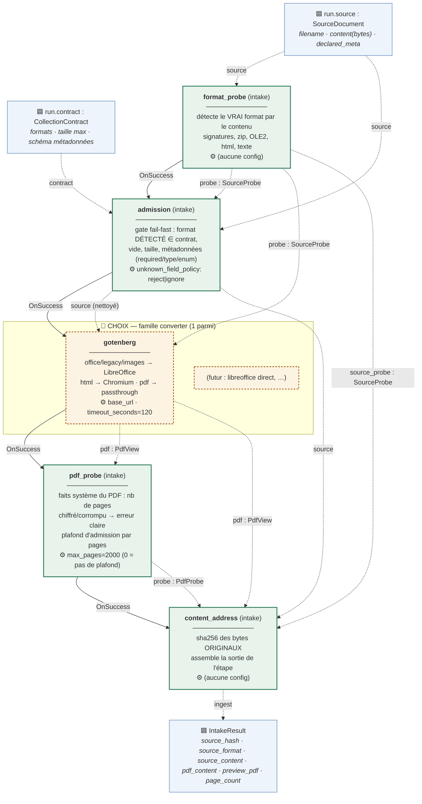
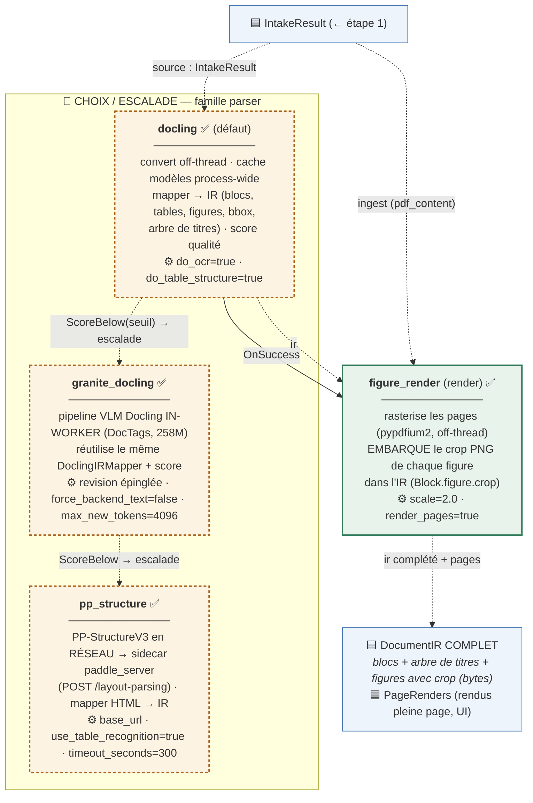
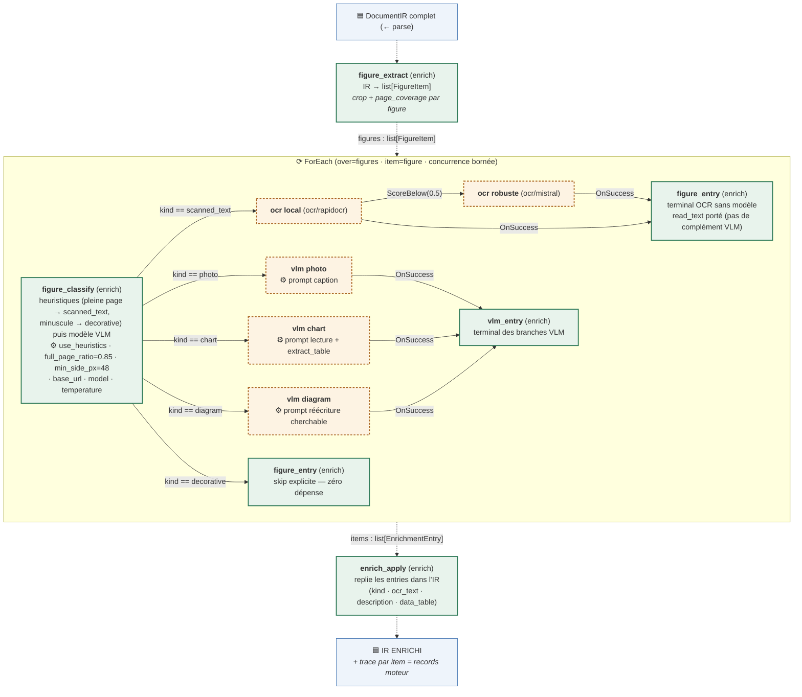

# DocForge — La Pipeline d'ingestion (document vivant)

> **Ce fichier est LA référence de la pipeline.** Il est tenu à jour à chaque évolution.
> Légende des statuts : ✅ construit & validé · 🔶 décision en attente · ⬜ à construire · 🅿️ code garé (placement à discuter)

---

## 1. Vue d'ensemble — les étapes

```mermaid
flowchart LR
    RUN(["RUN INPUT<br/>SourceDocument + CollectionContract"])

    subgraph S1["Étape 1 — INTAKE ✅"]
        direction LR
        s1["format_probe → admission → convert → pdf_probe → content_address"]
    end

    subgraph S2["Étape 2 — PARSE ✅"]
        s2["docling (défaut) → granite_docling / pp_structure (escalade)"]
    end

    subgraph S3["Étape 3 — ENRICH ✅"]
        s3["figure_extract → ⟳ForEach[classify → switch×5<br/>→ ocr(escalade)/vlm par classe] → enrich_apply"]
    end

    subgraph S4["Étape 4 — CHUNK ✅"]
        s4["famille chunker (CHOIX) :<br/>structure_aware / fixed_size / semantic"]
    end

    subgraph S5["Étape 5 — CONTEXTUALIZE ✅"]
        s5["méthodes EMPILABLES :<br/>doc_meta · breadcrumb · sliding · llm"]
    end

    subgraph S6["Étape 6 — METAGEN ✅"]
        s6["contract-driven : document + chunk<br/>LLM+prompt par champ · structured output"]
    end

    subgraph S7["Étape 7 — EMBED ✅"]
        s7["famille embed (CHOIX) : bge_server (dense+sparse)<br/>/ openai_compatible (dense) + vecteurs par champ sémantique"]
    end

    RUN --> S1 -->|"IntakeResult"| S2 -->|"DocumentIR"| S3 -->|"IR enrichi"| S4 -->|"chunks"| S5 --> S6 --> S7
```



**Principes** : pipeline **pure** (les nodes = Config + Consumes → Produces, zéro DB/S3) · le **worker** persiste aux bords via la façade `Database` · le contrat de collection arrive en **run input** · un node = interchangeable dans sa **famille** (choix UI).

**Organisation du code** : `pipelines/nodes/` = **uniquement les capacités génériques** (llm · ocr · vlm · **embed** · structgen · openai_compat (la factory partagée) — réutilisables par toute pipeline) · `pipelines/ingest/` = **LA pipeline d'ingestion** : `nodes/` **groupés par GRANDE ÉTAPE** + **`pipeline.py` → `IngestPipeline`**, la classe-lien qui déclare ses familles et porte le **describe** (`IngestPipeline.palette()`) qui peuplera l'UI.

```
pipelines/ingest/nodes/
├── intake/         admission · format_probe · pdf_probe · content_address · converter/gotenberg
├── parse/          parser/docling · parser/granite_docling · parser/pp_structure · figure_render
├── enrich/         figure_extract · figure_classify · figure_entry · vlm_entry · enrich_apply
├── chunk/          base · structure_aware · fixed_size · semantic (à plat — l'étape EST la famille)
├── contextualize/  base(helpers·enums) · breadcrumb · doc_meta · sliding · llm(=prep) · llm_apply* · keep_raw*
├── metagen/        base · prep(chunk_prep·document_prep) · apply(chunk_apply·document_apply) · skip (kind `metagen_skip`)*
└── deliver/        bundle (le terminal : assemble la sortie du run que le worker persiste)
```
*(`*` = nodes internes de câblage, `SELECTABLE=False` — cachés du picker de méthodes de la palette.)*

Les **familles** (palette UI) suivent les étapes — chaque nom est UNIQUE et sans ambiguïté : `intake` ·
`converter` · `parser` · `render` (figure_render) · `enrich` · `chunker` · `contextualize` · `metagen` ·
`deliver` (bundle — le terminal qui assemble la sortie du run) — plus les capacités
génériques `embed` · `ocr` · `vlm` · `llm` · `structgen`. Convention kinds : jamais de redondance famille+kind (`(ocr, mistral)` comme
`(llm, mistral)` ; `(contextualize, llm)` — pas de suffixes `_ocr`/`_context`).

> **Tout appel d'interface standard est une CHAÎNE externalisée (P1–P6, terminé).** Un node d'action qui
> appelle un `parser`/`ocr`/`vlm`/`embed`/`llm`/`structgen` ne cache plus l'appel : il délègue à une **chaîne =
> providers en nodes + transitions de fallback dans le graphe** (`ScoreBelow(seuil)` si la famille est `scored`,
> sinon `OnFailure`), convergeant en `FromFirst` (meilleur d'abord). Motif uniforme `prep → chaîne → finalize`.
> **Un provider unique = une chaîne à 1 étape** (byte-identique à avant). Socle partagé : `ChainFragmentBuilder`,
> `ChainRules.resolve()`, le `ChainWalker` (lecture inverse) réutilisés partout.

---

## 2. Étape 1 — INTAKE ✅ (validation + préparation du document, 5 nodes)

**Rôle** : vérifier ce qui est fourni (contrat) et produire l'`IntakeResult` que le parse consomme.



> **Lecture** : flèches pleines = contrôle (transitions) · flèches pointillées = données (bindings). Un node peut consommer la sortie de **n'importe quel** node amont (ex. `content_address` lit `admit`, `convert` ET `pdf_probe`).

### Détail des nodes

| Node | Config | Consomme (slot : artefact ← lié à) | Produit |
|---|---|---|---|
| **format_probe** | — | `source : SourceDocument` ← run | `probe : SourceProbe` |
| **admission** | `unknown_field_policy` = reject\|ignore | `source` ← run · `probe : SourceProbe` ← format_probe · `contract : CollectionContract` ← run | `source : SourceDocument` (méta nettoyées) |
| **convert / gotenberg** | `base_url` (requis) · `timeout_seconds`=120 | `source` ← admission · `probe` ← format_probe | `pdf : PdfView` (None si inconvertible → dégradation) |
| **pdf_probe** | `max_pages`=2000 (0 = pas de plafond) | `pdf : PdfView` ← convert | `probe : PdfProbe` (page_count) — un PDF au-delà de `max_pages` est rejeté ICI, avant parse/OCR |
| **content_address** | — | `source` ← admission · `source_probe : SourceProbe` ← format_probe · `pdf` ← convert · `probe` ← pdf_probe | `ingest : IntakeResult` |

**Cas d'échec (le run s'arrête, message précis)** : format détecté non accepté (extension spoofée incluse) · fichier vide · taille dépassée · champ requis manquant · champ inconnu (si reject) · type/enum invalide · champ generated/system fourni · PDF chiffré ou corrompu · PDF au-delà de `max_pages` (plafond d'admission avant parse/OCR).

**Formats détectés** : pdf · docx/xlsx/pptx · doc/xls/ppt (OLE2) · odt/ods/odp · rtf · html · csv · md · txt · png/jpeg.

---

## 3. Étape 2 — PARSE ✅ (parser + complétion de l'IR)

**Rôle** : `IntakeResult` → **`DocumentIR` ULTRA COMPLET** — la structure (parseur) **puis** l'embarquement des
images de figures dans l'IR (`figure_render`). L'enrich reçoit un IR où chaque figure porte déjà ses bytes.
(markdown/html = vues générées à la demande par le backend, hors pipeline.)



| Node | Config | Consomme | Produit |
|---|---|---|---|
| **parser / docling** | `do_ocr`=true · `do_table_structure`=true | `source : IntakeResult` ← étape 1 | `ir : DocumentIR` + `score` (part des blocs avec contenu : texte **ou** table ; figures = non → signal scan) |
| **parser / granite_docling** | `revision` (épinglée) · `force_backend_text`=false · `max_new_tokens`=4096 | `source : IntakeResult` ← étape 1 | `ir : DocumentIR` + `score` (VLM DocTags in-worker — MÊME mapper/score que docling, GPU en pratique) |
| **parser / pp_structure** | `base_url` (requis) · `api_key` · `use_table_recognition`=true · `use_formula/seal/orientation/unwarping`=false · `timeout_seconds`=300 (+ hérite `TimeoutRetryConfig` : `max_retries`, `retry_backoff_seconds`, `preflight_timeout_seconds`) | `source : IntakeResult` ← étape 1 | `ir : DocumentIR` + `score` (POST /layout-parsing au sidecar `paddle_server` — parser RÉSEAU) |
| **parse / figure_render** | `scale`=2.0 · `render_pages`=true | `ingest : IntakeResult` ← étape 1 · `ir : DocumentIR` ← parser | `ir : DocumentIR` **complété** (crops embarqués) · `pages : PageRenders` |

**Contrat de la famille** (`BaseParserNode`) : tout parseur consomme `{source: IntakeResult}` et produit `{ir, score}` ; pas de PDF → IR vide + score 0 (dégradation) ; l'escalade se câble dans le graphe par `ScoreBelow(threshold)` — rien à changer au moteur.

**Doctrine scans (persona-hardening — OCR-default)** : `do_ocr=true` **par défaut** — c'est l'OCR *interne* de
docling (local, in-stack, aucune API externe), qui ne s'applique qu'aux régions bitmap sans couche texte : un
PDF/HTML digital-born (déjà porteur de texte) reste intouché, un scan ou une photo rend du texte cherchable
out-of-box (sans lui une page image perdrait SILENCIEUSEMENT tout son texte). Désactivable (`do_ocr=false`) sur un
corpus purement text-only. Ceci est **orthogonal à l'enrich** : docling fournit la STRUCTURE + le texte des zones
bitmap, tandis que la décision fine « qu'est cette zone non-texte » (`SCANNED_TEXT` / logo / photo / chart) se
prend toujours à la **maille du bloc IR** dans l'**enrich** (heuristiques + modèles, chaîne + escalade + trace),
qui décrit/relit les figures avec les providers puissants. **Aucun flag scan en amont** (supprimé — il faisait
double emploi à une maille moins fine) ; les faits catalogue `document.source_kind` et `page.is_scanned` (DB) sont
**dérivés de la classification enrich** à la persistance. ⚠️ Sur un scan, un score de parse bas peut rester NORMAL
— ne pas configurer aveuglément d'escalade de parseurs dessus.

---

## 3b. Étape 3 — ENRICH ✅ (par-item sur les primitives moteur : ForEach + WhenEquals + FromFirst)

**Rôle** : pour **chaque figure** de l'IR complet — classifier (5 classes), router vers SON chemin,
OCR avec escalade, décrire, puis replier le tout dans l'IR. **Tout est graphe** : l'aiguillage par classe =
des transitions `WhenEquals` visibles, l'escalade OCR = un `ScoreBelow` par item, la convergence = `FromFirst`.

> **Source unique de la taxonomie** : les 5 classes, leurs branches (`FIGURE_BRANCHES`), les classes
> decorative et le prompt du classifieur **dérivent tous** de `FigureKind` via `public_models/ir/figure_routing.py`.
> Ajouter une classe = une entrée dans `FIGURE_ROUTING` ; une classe sans branche **échoue à l'import ET au
> build** (garde), plus jamais silencieusement au runtime. La lecture OCR voyage sous `FigureItem.read_text`
> (renommé depuis `context`, qui prêtait à confusion avec `Chunk.context`).

> **Knobs enrich** (sur `FigureClassifyConfig`, rendus par le panneau dédié `EnrichClassifyPanel`) :
> `figure_enrich_mode` — `classified` (défaut, le graphe ci-dessous) · `uniform` (ex-`ocr_only`, alias
> accepté) : l'assembleur émet un corps SANS classifieur ni `WhenEquals` — chaque figure passe par UN seul
> traitement (`OnFailure` fail-soft). `uniform_treatment` — `ocr` : une chaîne OCR locale → `figure_entry` ;
> `vlm` : une chaîne vision (décrire, **prompt configurable**) → `vlm_entry` (slot `figure_describe_vlm`).
> `classify_backend` — `vlm` (défaut) · `local` : classification hors-ligne (heuristiques géométriques +
> densité de texte via `RapidOcrEngine`, modèle chargé 1×/process), **aucun appel hosté**, même taxonomie/
> routing. Combinables ; défaut byte-identique à l'existant.



> **Lecture** : la branche `scanned_text` est **OCR-seule** — l'OCR local escalade en OCR robuste (`ScoreBelow`),
> puis se referme sur un `figure_entry` sans modèle dont le slot lit **FromFirst**([ocr_robuste, ocr_local]) : le
> terminal reçoit la lecture de celui qui a RÉELLEMENT tourné (il n'y a **pas** de complément VLM après l'OCR). Les
> branches visuelles (photo/chart/diagram) sont des chaînes VLM se refermant sur `vlm_entry`. Tous les terminaux du
> corps produisent le même `EnrichmentEntry` (contrat de collection).

### Les nodes (famille `enrich`, dédiés — dans `pipelines/ingest/nodes/`)

| Node | Config | Consomme | Produit |
|---|---|---|---|
| **figure_extract** | — | `ir : DocumentIR` | `figures : list[FigureItem]` (crop + coverage ; sans crop = skippé) |
| **figure_classify** | `use_heuristics` · `full_page_ratio` · `min_side_px` · `base_url` · `api_key` · `model` · `temperature` · `max_tokens` · `timeout_seconds` | `figure` | `figure` (kind estampillé) · `kind` (routé par WhenEquals) · `score` (réponse inutilisable → photo à 0.3, rattrapable par ScoreBelow) |
| **figure_entry** | — | `figure` | `entry : EnrichmentEntry` (terminal sans modèle : skip decorative / OCR-seul) |
| **enrich_apply** | — | `ir` · `entries : list[EnrichmentEntry]` | `ir` ENRICHI (slots figure remplis ; blocs sans entry intouchés) |

### Les providers (familles génériques `ocr` / `vlm` — par item, hooks inchangés)

| Famille | Node | Config | Contrat |
|---|---|---|---|
| `ocr` | **rapidocr** ✅ | — (local, modèles embarqués) | `{figure}` → `{figure(read_text rempli), score=confiance réelle}` (**testé : 0.97 sur vraie image**) — l'escalade = transition `ScoreBelow` |
| `ocr` | **mistral** ✅ | `base_url` · `api_key` · `model` · `timeout_seconds` | idem — queue robuste (API /ocr, data-url) |
| `ocr` | **paddle** ✅ | `base_url` · `api_key` · `timeout_seconds` | idem — OCR d'un crop via le sidecar in-stack `paddle_server` (PaddleOCR det+rec) |
| `vlm` | **openai_compatible** ✅ | `base_url` · `api_key` · `model` · **`system_prompt`** · `max_tokens` · `temperature` · **`extract_table`** · `timeout_seconds` | `{figure}` → `{entry}` — **ferme la branche** (description + table parsée + ocr_text/kind portés) |

**Prouvé e2e via blob** (6 figures, les 5 classes) : heuristiques (3 appels modèle économisés sur 6),
escalade par-item (le scan difficile : cheap 0.2 → robuste, `FromFirst` alimente le VLM avec « ROBUST READ »),
chart→table parsé, decorative = zéro dépense, bloc sans crop intouché, trace complète par item dans les records.

**Fail-soft (décidé ✅, prouvé e2e)** : l'enrichissement est *best-effort* — un provider qui plante ne doit PAS
faire échouer le document. La topologie par défaut câble des arêtes **`OnFailure → figure_entry`** sur classify
et sur chaque VLM terminal : la figure fautive dégrade en entry sans description (classify KO → slot intouché ;
VLM KO → kind conservé, pas de description), le document survit, et **les échecs restent tracés** (records
`failed` + fallback visible). Ni policy cachée ni changement moteur : de la mécanique de graphe ordinaire.
*(Le fallback du clf se binde sur l'item brut `FromGroupInput` — la figure estampillée n'existe pas si le
classify lui-même a échoué.)*

---

## 3c. Étape 4 — CHUNK ✅ (famille `chunker` : on CHOISIT sa méthode, comme un provider LLM)

**Rôle** : l'IR **enrichi** → les `Chunk` BRUTS (le contextualize enrichira le texte à l'étape d'après :
breadcrumb, préfixe LLM…). **Un seul contrat pour toutes les méthodes** : `{ir: DocumentIR} → {chunks: list[Chunk]}`
— interchangeables dans l'UI.

### Le socle commun (`chunker/base/`) — la projection + les RÈGLES DE COMPOSITION
Quelle que soit la méthode, l'IR est d'abord projeté en **passages** ordonnés, règles appliquées UNE fois :
- **Figure + sens = UNE unité ATOMIQUE**, rendue de sorte que le contenu dérivé d'image ne se confonde jamais avec
  de la prose native dans le texte du chunk : la **caption + le texte natif** en tête (prose réelle, verbatim),
  puis la **description VLM** sur sa ligne, le **texte OCR** sous `[OCR]`, et la grille `chart_to_data` sous
  `[Data]` (table markdown, 1re ligne = en-tête). ⚠️ **Aucun marqueur `[Image: <kind>]` n'est émis** (choix
  délibéré : il ne porte aucun texte cherchable et ferait matcher une requête « photo »/« chart » nue sur un chunk
  vide de réponse). Le **bloc CAPTION adjacent** est replié dans l'unité (les parseurs l'émettent séparé —
  block_ids inclus) ; parties vides ignorées ; insécable (`figures_atomic`) — une figure sans contenu enrichi
  (decorative, ou crop seul enrich-off) n'apporte RIEN (rendue à `None`, jamais un placeholder) ;
- **Table → markdown**, atomique (`tables_atomic`), caption adjacente repliée aussi — jamais coupée en deux ;
- **mobilier structurel classé par `role`, gardé mais désactivé** (jamais droppé — inspectable/réactivable, non
  embeddé) : `header_footer` (type de bloc IR), `toc` (titre = match exact de l'allow-list), et **`boilerplate` =
  répétition inter-pages** (un pré-pass mappe le texte normalisé de chaque bloc à ses pages **distinctes** ;
  au-delà de `boilerplate_min_pages`, défaut 3 → BOILERPLATE ; `detect_repeated_boilerplate` on/off par collection).
  Le **chrome web** (barres de navigation/menus, widgets de recherche, placeholders « no results » déversés d'une
  page HTML) est lui aussi rangé en BOILERPLATE — conservateur, seul le chrome évident est rétrogradé, jamais de la
  vraie prose (`detect_web_chrome` on/off par collection, défaut on). Ces passages partent en chunks-mobilier
  séparés (`role_default_enabled` → `enabled=false`), **retirés du texte body** ;
- un **heading orphelin** (titre sans corps propre) n'est jamais un chunk isolé : replié en breadcrumb dans la
  section suivante (ou la précédente s'il est en fin) ;
- `heading_path` + identité de section calculés (l'arbre de titres du parse ; **garde
  anti-cycle** sur une chaîne de parents corrompue) ;
- comptage **tiktoken** exact (`tokenizer_encoding`, défaut cl100k_base ; premier chargement **hors event loop** —
  pré-charger le cache BPE dans l'image worker : suivi infra) ;
- un passage trop gros se découpe **en phrases**, et une phrase sans frontière (texte fleuve, dump d'URLs) subit
  une **coupe dure au token** — *rien de non-atomique ne dépasse le plafond d'une méthode* ; un atomique plus gros
  que la fenêtre reste **seul** dans son chunk (jamais collé à une graine d'overlap). Les plafonds sont souples à
  la marge des jointures (`

`) — `token_count` est le recompte honnête du texte final.

### Les méthodes

| Kind | Config propre | Principe |
|---|---|---|
| **structure_aware** ✅ | `target_tokens`=512 · `max_tokens`=1024 · `min_tokens`=64 · `overlap_tokens`=64 · `hard_section_boundaries`=true | Empaquette LE LONG de l'arbre : frontière de section = coupe dure pour toute section ≥ `min_tokens`, **MAIS** les sections consécutives **< `min_tokens`** sont **fusionnées à travers les frontières** jusqu'à `min(target, max)` (fin de la sur-fragmentation ; une grosse section n'absorbe jamais et n'est jamais absorbée). Le `heading_path` d'un chunk fusionné = **préfixe commun** des sections coalescées (`[]` si non liées, l'ancêtre partagé sinon). Overlap optionnel (coupes de taille uniquement) |
| **fixed_size** ✅ | `chunk_tokens`=512 · `overlap_tokens`=64 (< chunk, validé) | La classique : fenêtres de N tokens, aveugle à la structure, queue répétée en overlap |
| **semantic** ✅ | `base_url` · `api_key` · `model` · `buffer_size`=1 · `breakpoint_percentile`=90 · `min_tokens` · `max_tokens` · `timeout_seconds` | **Embedding-windows** : phrases → fenêtres de contexte embeddées (endpoint openai-compat : bge_server, OpenAI…) → coupe là où la distance cosinus SAUTE (percentile) = au changement de sujet ; bornes de taille ensuite |

*(La famille est ouverte : `late_chunking`, `page_based`… s'ajouteront comme un provider de plus.)*

**Prouvé e2e** : projection (figure fusionnée atomique, table markdown, decorative/header-footer exclus,
sections calculées) · structure_aware (grosses sections jamais mélangées ; **petites sections consécutives
< `min_tokens` coalescées** à travers les frontières, `heading_path` = préfixe commun ; paragraphe géant coupé
en phrases, ids/ordinaux/pages/block_ids cohérents) · fixed_size (fenêtres + overlap répété, overlap ≥ fenêtre rejeté au build) ·
semantic (faux embeddings 2 topics → **la coupe tombe exactement au changement de sujet**) · blob build+validate+run.

---

## 3d. Étape 5 — CONTEXTUALIZE ✅ (famille `contextualize` : des méthodes EMPILABLES)

**Rôle** : enrichir le **contexte de recherche** des chunks sans jamais toucher au texte brut. Contrairement au
chunker (choix exclusif), ces méthodes **s'empilent** : une seule face `{chunks} → {chunks}`, on les **chaîne
dans le graphe**, et l'ordre de câblage = l'ordre d'accumulation des préfixes dans `Chunk.context`
(le texte embeddé sera `enriched_text` = context + texte brut ; le brut reste stocké, l'enrichi re-dérivable).

| Kind | Ajoute | Coût | Config |
|---|---|---|---|
| **doc_meta** ✅ | UNE ancre document, identique pour tous les chunks : le titre déclaré (`title_field`), sinon (repli gratuit, déterministe) le PREMIER titre de niveau 1 du document — consomme `source` (run, titre déclaré) ET `ir` (repli titre) | zéro | `title_field`=title · `fallback_to_heading`=true |
| **breadcrumb** ✅ | le fil d'Ariane rendu depuis `heading_path` (`Section: A > B`) — chunk hors section : rien | zéro | `template` · `separator=" > "` · `max_depth` (0 = tout) |
| **sliding** ✅ | la fin du chunk précédent / le début du suivant (continuité aux frontières, borné en MOTS) | zéro | `prev_words=40` · `next_words=0` · templates |
| **llm** ✅ | **le contextual retrieval d'Anthropic** : le modèle lit une vue du document + le chunk et écrit 1-2 phrases situantes | 1 appel/chunk | `system_prompt` · **`document_scope`** · `window_chunks=2` · `max_document_words=4000` · `max_concurrency=4` · **`on_error`** — l'endpoint + les paramètres de génération (`base_url`/`api_key`/`model`/`max_tokens`/`temperature`) ont migré (P6) hors de la config méthode : ils vivent sur les **steps de la chaîne llm** que le corps du ForEach exécute |

**Les règles du `document_scope`** (la vue est construite **depuis les chunks eux-mêmes** — aucune consommation
d'IR, la face reste uniforme) : `full` = tout le document (tronqué à `max_document_words`, depuis le début) ·
`section` (défaut) = les chunks frères de même `heading_path` · **repli** : un chunk hors section bascule sur
`window` = ± `window_chunks` voisins.

**Dégradation** : un échec modèle sur UN chunk le laisse **brut** (`on_error=keep_raw`, loggé) — le document
n'échoue jamais pour un 503 ; `fail` pour les runs stricts. **Ordre par défaut recommandé** : `doc_meta →
breadcrumb → llm` (du général au spécifique).

**Externalisé en chaîne (P6)** : la méthode `llm` ne cache plus l'appel modèle — elle compile en
`prep → ForEach(chaîne llm générique [+ keep_raw]) → apply`. Le `prep` (kind `llm`, la méthode pickable)
construit la vue **une fois** et émet un `Prompt` par chunk **dans l'ordre** ; le corps du ForEach est une
**chaîne de providers `llm`** avec fallback `OnFailure` (le llm n'est pas `scored` → pas de `ScoreBelow`),
terminée par `keep_raw` (Completion vide → `_with_context` no-op → chunk brut) quand `on_error=keep_raw` ;
`apply` recolle les complétions aux chunks **par ordre** (`zip(strict=True)`, 1 chunk → 1 appel). La méthode
porte sa `ChainSpec` dans le `StackMethod` (éditée via `set_stack`) — un provider unique = une chaîne à 1 étape.

**Prouvé e2e** : chaque méthode isolée (rendu, repli hors-section, bornes de mots, copies jamais mutées) ·
les scopes du LLM vérifiés par capture (la section ne voit pas les autres sections ; le repli window inclut les
voisins) · keep_raw (le chunk fautif reste brut, le doc survit) et fail strict · **l'empilement en blob** :
`doc_meta → breadcrumb → llm` → les 3 préfixes dans l'ordre exact du câblage.

---

## 3e. Étape 6 — METAGEN ✅ (famille `metagen` : les métadonnées générées, pilotées par le CONTRAT)

**Rôle** : remplir les champs `origin=GENERATED` du contrat de collection par LLM. **Le two-step décidé** :
le CONTRAT déclare les champs (nom, type, scope) — la CONFIG du node lie **par champ** un prompt + un LLM.
Le **type du champ force la sortie** via structured output (schéma JSON dérivé de `FieldType`), et la valeur
retournée subit une **coercition stricte** (`"2024"` → int, ISO → datetime normalisé, liste nettoyée) — une
valeur incoercible est **absente**, jamais fausse en base.

**Externalisé en chaîne (P5)** : metagen fait de la **génération STRUCTURÉE** (`with_structured_output(schema)`,
schéma dérivé du `FieldType`, coercition stricte) via une capacité générique **`structgen`** (`schema → GeneratedValues`,
l'analogue de `vlm → EnrichmentEntry`). Chaque scope compile en `prep → ForEach(chaîne structgen [+ skip]) → apply` :
le `prep` groupe les champs par la molette `grouping` et émet une `GenerationRequest` par groupe ; le corps du ForEach
est une **chaîne de providers `structgen`** avec fallback `OnFailure` (non-`scored`), terminée par `skip` (valeurs
absentes) quand `on_error=skip_fields` ; l'`apply` recolle les valeurs par `chunk_id` (metagen est 1 chunk → N groupes,
donc clé et non ordre — à la différence de contextualize/llm).

| Scope | Nodes externalisés | Consomme → Produit |
|---|---|---|
| **document** ✅ | `document_prep → ForEach(chaîne structgen [+ skip]) → document_apply` | `chunks` (vue doc, plafonnée `max_document_words`) · `contract` (run) → `meta : GeneratedDocumentMeta{values}` |
| **chunk** ✅ | `chunk_prep → ForEach(chaîne structgen [+ skip]) → chunk_apply` | `chunks` (texte ENRICHI) · `contract` → `chunks` (`generated_meta` rempli en copies) |

**La config du prep** (commune, + le endpoint par défaut hérité d'`OpenAICompatConfig`, porté par chaque `GenerationRequest`) :
- **`targets`** : les liaisons par champ `{field · prompt (vide = auto-dérivé nom+type) · base_url/api_key/model
  (vides = défaut du node)}` — vide = TOUS les champs generated du scope ; un target inconnu/non-generated →
  **échec bruyant avant toute dépense** ; un sous-ensemble = plusieurs instances légitimes (`UNIQUE_IN_GRAPH=False`) ;
- **`grouping`** (le paramétrable demandé) : `combined` = les champs partageant un endpoint demandés dans UN objet
  structuré · `per_field` = un appel par champ ;
- `system_prompt` · `temperature` · `max_tokens` · `max_concurrency` (maille chunk) · **`on_error`** =
  `skip_fields` (défaut — un 503 laisse les champs absents, le document survit) | `fail`.

**La factory F4 pliée** : nouveau module générique **`pipelines/nodes/openai_compat/`** (`OpenAICompatConfig`
mixin + `OpenAICompatHelpers.chat()/embeddings()`) — les **6 consommateurs** (llm/openai_compatible, vlm,
figure_classify, contextualize/llm, chunker/semantic, metagen) construisent leurs clients au même endroit ;
le littéral `"unused"` n'existe plus qu'une fois.

**Prouvé e2e** : contract-driven (champ USER ignoré, 1 appel combiné), coercitions (str→int, datetime ISO,
keyword_list nettoyée, incoercible jeté), liaison LLM par champ (`m-big` pour le résumé, défaut pour le reste),
`combined` groupé PAR endpoint vs `per_field`, target inconnu → erreur avant dépense, chunk-503 → skip, texte
enrichi vérifié en entrée, blob `chunk → document` validé et exécuté.

---

## 3f. Étape 7 — EMBED ✅ (famille générique `embed` : les vecteurs, reliés aux chunks)

**Rôle** : la DERNIÈRE étape — chaque chunk devient ses vecteurs Qdrant. **Le chunk reste l'élément textuel**
(brut + contexte + meta générées) ; **ses vecteurs vivent à part, reliés par `chunk_id`** (`ChunkEmbeddings{model,
dimension, items[]}` avec `ChunkVectors{chunk_id, dense, sparse, fields}`) — le worker zippe les deux en points.
Le texte embeddé est l'**`enriched_text`** (toute la raison d'être du contextualize). Famille **générique**
(`pipelines/nodes/embed/`) — la recherche s'en resservira pour les requêtes.

| Kind | Protocole | Produit |
|---|---|---|
| **bge_server** ✅ | notre serveur custom (BGE-M3, TEI-compat) : `/embed_all` (dense+sparse en UNE passe) avec repli `/embed` + `/embed_sparse` sur un serveur plus ancien (404) | dense **+ sparse** — le défaut du produit · `UNIQUE_IN_GRAPH=True` |
| **openai_compatible** ✅ | `/v1/embeddings` via la factory | dense seul (le protocole n'a pas de sparse — axe sauté proprement, loggé) |

**Config commune** : `model` (provenance, stocké avec les vecteurs) · `batch_size=32` · `embed_sparse=true` ·
**`embed_semantic_fields=false`** (défaut) — quand activé, les champs chunk-scope `semantic=True` du contrat
sont embeddés en **vecteurs nommés par champ** (`fields["keywords"]` — seulement les chunks qui portent une
valeur ; une liste se rend en texte joint). Le **read-side EST câblé** : un `SearchTarget{field, semantic}` sur un
champ métadonnée résout vers `meta_<slug>_dense` (via `TargetVectorResolver`, à côté du read port) et le retrieve
l'interroge. ⚠️ **OFF par défaut** malgré tout, par pur **coût** : les cibles de recherche par défaut sont
content-only (`default_content_targets`), donc sans requête métadonnée explicite on paierait embedding + stockage
pour des vecteurs non interrogés. À activer quand une collection exploite la recherche sémantique par champ.
Doc-scope sémantique : hors v1 (les points Qdrant sont des chunks).

**Échec = fatal** (pas de dégradation ici : un chunk sans vecteur est ininde­xable).

**Trace compactée** (même doctrine que les bytes) : dans les records, une longue liste numérique devient
`'<1024 numbers>'` — la donnée réelle circule intacte dans le graphe, seule la copie-souvenir est compactée.

**Prouvé e2e** : batching (5 textes / batch 2 = 3 appels), texte enrichi vérifié en entrée, liaison chunk_id
ordonnée, sparse présent (bge fake) / sauté proprement (dense-only), vecteurs par champ sémantique uniquement où
la valeur existe (non-sémantique et doc-scope ignorés), blob validé+exécuté, **records : vecteurs réels en sortie
vive, `'<100 numbers>'` dans la trace**.

---

## 4. Les artefacts (le vocabulaire qui circule)

| Artefact | Champs | Produit par → consommé par |
|---|---|---|
| `SourceDocument` | filename · content (bytes) · declared_meta | run input → probe, admit, convert, content_address |
| `CollectionContract` | collection_id · name · supported_formats · max_file_size_bytes · fields[] (name, type, required, filterable/lexical/semantic, origin, scope) | run input → admit (+ metagen/embed plus tard) |
| `SourceProbe` | format · mime_type · file_size | format_probe → admission, convert |
| `PdfView` | content (bytes \| None) · preview_content (bytes \| None, PDF de visu seul) | convert → pdf_probe, content_address |
| `PdfProbe` | page_count | pdf_probe → content_address |
| `IntakeResult` | source_hash · source_format · source_content (bytes originaux — parse natif html/md) · pdf_content (vue PDF consommée par le parseur ; None si natif/inconvertible) · preview_pdf (PDF de VISU seul, jamais parsé — pour html/md rendus nativement) · page_count | content_address → **parser, figure_render** |
| `DocumentIR` | doc_id · source_hash · title · n_pages · language · blocks[] (figures avec `crop: bytes` après figure_render) | parser → figure_render → **enrich, chunk** (+ vues backend) |
| `PageRenders` | pages[] (png, dimensions) | figure_render → worker (blobs `page.render_blob_hash`) |
| `FigureItem` | block_id · image (bytes) · page_coverage · kind · read_text | l'item du ForEach enrich — enrichi en copies au fil du corps (classify estampille `kind`, l'OCR remplit `read_text`) |
| `EnrichmentEntry` | block_id · kind · ocr_text · description · data_table | le terminal UNIFORME de chaque branche enrich → collecté par le ForEach → enrich_apply |
| `ChunkEmbeddings` | model · dimension · items[] (`ChunkVectors{chunk_id, dense, sparse, fields}`) | embed → worker (points Qdrant, zippé avec les chunks par chunk_id) |
| `GeneratedDocumentMeta` | values (champ → valeur coercée) | metagen/document → worker (`document_metadata`) |
| `Chunk` | chunk_id · ordinal · text (BRUT, jamais retouché) · block_ids (relation chunk↔IR → `chunk_block`) · token_count · heading_path · page_start/end · **context** (accumulé par contextualize) · **generated_meta** (rempli par metagen) · `enriched_text` = context + text | chunker → **contextualize, metagen, embed** |

---

## 5. Rappel — la mécanique du graphe

- **Transitions** (contrôle) : `OnSuccess` (défaut) · `OnFailure` (recovery/escalade) · `ScoreBelow(threshold)` (escalade qualité) · **`WhenEquals(field, equals)`** (le switch — routage par valeur, ex. par classe de figure) · `Always`. **Priorité** : `ScoreBelow > WhenEquals > OnSuccess/OnFailure > Always` (la qualité escalade avant de router).
- **Bindings** (données) : `FromRunInput(field)` · `FromNode(node_id, field)` (n'importe quel amont) · `FromGroupInput(field)` · **`FromFirst(candidates)`** (la jointure de convergence : après un embranchement `ScoreBelow`/`OnFailure`, le slot lit le PREMIER candidat qui a réellement produit — chaque candidat validé comme un `FromNode`). Slots typés : classe d'artefact nue **ou `list[Classe]`**.
- **`ForEach`** (le sous-graphe par item) : `over` (un champ `list[T]` amont) · `item_field` (l'item exposé au corps) · `max_concurrency` · **contrat de collection** : tous les terminaux du corps produisent le MÊME **Artifact** à slot unique (les scalaires type `str` sont refusés) → le ForEach produit `items: list[T]` (ordre préservé, 1 record d'exécution par item `body[i]`, échec d'item = échec bruyant). L'escalade (`ScoreBelow`) et le switch (`WhenEquals` — avec **default** possible via une arête `OnSuccess`) fonctionnent PAR ITEM dans le corps. *(Re-audit adversarial passé : 3 crash-paths corrigés ; la progress porte désormais l'index d'item — compteur live `items_done`/`items_total` sur la racine fan-out et `failed_item_index` sur l'échec.)*
- **Configs** : chaque node = une `NodeConfig` (`extra="forbid"` → un typo dans le blob **fait échouer le build**, jamais ignoré). Tout node **RÉSEAU** hérite la surface partagée `TimeoutConfig` (`timeout_seconds`, `preflight_timeout_seconds`) — et `TimeoutRetryConfig` (+ `max_retries`, `retry_backoff_seconds`) pour ceux qui retentent — chaque famille ne re-déclarant que le DÉFAUT dont elle a besoin ; **par collection dans le blob**. Un budget wall-clock de tout le job d'ingest est porté par le champ collection **`job_timeout_seconds`** (nullable ; NULL = défaut worker `WORKER_JOB_TIMEOUT_SECONDS`, migration `b1c7e9a4d2f8`) ; plusieurs cadences worker sont passées en env `RUNTIME_CONFIG` (grâce, timeout Qdrant, heartbeat, health-check, intervalle du reaper, poll SSE app-side).
- **`UNIQUE_IN_GRAPH`** (le flag de multiplicité, exposé par `describe()` et rejeté par le validateur en
  doublon — `duplicate_unique_node`) : **True** quand une 2e instance du kind est une erreur de câblage —
  logique d'étape et structurel (les 4 nodes intake · gotenberg · les 3 parseurs docling · granite_docling ·
  pp_structure — chacun unique par kind, mais empilables en escalade car kinds DIFFÉRENTS · figure_render ·
  figure_extract · enrich_apply · les 3 chunkers · breadcrumb · doc_meta · sliding · deliver/bundle · les 2
  embedders bge_server · openai_compatible). **False** (défaut) quand la répétition est
  légitime : providers en escalade du MÊME kind avec configs différentes (ocr/vlm/llm), terminaux multi-branches
  (figure_entry ×2 dans le fail-soft), classify en escalade, contextualize/llm multi-passes.
- **Validation à la création** (avant toute dépense) : entrée unique · pas de cycle · pas de fan-out ambigu · bindings amont + types compatibles · ScoreBelow ⇒ producteur scoré · unicité des nodes single-use.

---

## 6. 🔶 Décisions en attente / 🅿️ code garé

| # | Sujet | État |
|---|---|---|
| 1 | ~~`is_scanned` (global ou par page)~~ **CLOS** : flag supprimé de l'ingest — la vérité se décide à la maille **bloc IR** (enrich, heuristiques + modèles) ; `pdf_probe` = faits système uniquement (pages, lisibilité) ; `source_kind`/`page.is_scanned` (DB) dérivés de la classification enrich à la persistance | ✅ décidé |
| 2 | ~~Routage scan → OCR~~ **TRANCHÉ (révisé persona-hardening)** : `do_ocr=true` par défaut (OCR interne docling, local, régions bitmap seules ; désactivable sur un corpus text-only) pour le texte des zones scannées ; l'**enrich** classifie en plus (`SCANNED_TEXT`/logo/photo/chart) et OCRise/décrit les figures avec les chaînes puissantes (voir §3) | ✅ décidé |
| 3 | ~~`figure_render`~~ **PLACÉ** (décision) : fin de l'étape **parse** (famille `parse`) — l'IR sort « ultra complet », chaque figure porte son crop ; l'enrich ne prépare rien, il décide. **`MarkdownSerializer`** reste 🅿️ garé (vue backend, placement à discuter avec le backend) | ✅ / 🅿️ |
| 4 | ~~**Worker** : remapper les ids de blocs sur l'UUID du document à la persistance (sinon collision de PK entre collections/versions)~~ **FAIT** : le block-id remap vit dans `worker/backend/libs/persistence/translator.py` (`__block_id`, id préfixé par le document) | ✅ fait |

---

*Dernière mise à jour : les 7 étapes (INTAKE → EMBED) construites, câblées dans le blob par défaut et validées au build.*

---

## 7. La surface de design (défaut = produit maigre · avancé = API headless — zéro texte en dur)

**Le défaut est preflight-clean** — `default_blob()` livre **ON** uniquement les stages joignables avec
les services in-stack (`intake`/`parse` docling · `contextualize` local · `embed` bge_server). Les stages
**provider-hosted** — figure `ENRICH` (VLM) et `METAGEN` chunk/document (LLM) — livrent **OFF**, leurs
providers recommandés pré-remplis mais **jamais exécutés** : une collection fraîche ingère n'importe quel
document avec **zéro config externe**. Les activer est un opt-in explicite dans le studio (flip du stage +
endpoint réel). C'est ce qui rend `WORKER_PREFLIGHT_ENABLED` **on par défaut** sans danger (aucun
placeholder n'est jamais dans un graphe exécuté out-of-box — cf. invariant #4).

**La découverte d'abord** — `GET /api/v1/pipelines` : la liste des surfaces de design disponibles
(`{key, title, description, design_url, inspect_url, edit_url, stages_view_url, stages_apply_url}`) — le SEUL
appel que l'UI connaît d'avance ; tout le reste se découvre.

**Le contrat de collection est schema-driven** — `GET /api/v1/collections/contract-schema` expose l'identité et
les limites de la collection (dont `job_timeout_seconds`) en **JSON Schema** — le même mécanisme que le
`config_schema` d'un node — et l'UI le rend via `SchemaForm`, si bien qu'un nouveau champ du contrat **remonte
automatiquement** dans le formulaire sans code front dédié.

**L'UI canvas est retirée** (la page éditeur POC `/ingest/editor`, le feature React `pipeline-editor/` et les
`recipes` avec elle) : le produit rend un **rail de stages** à forme fixe ; le niveau graphe reste servi en
**API headless** (contrats conservés et testés) pour un futur mode avancé.

### La surface PRODUIT (le stage rail — deux appels pour s'ouvrir)

| Appel | Contenu | D'où ça vient |
|---|---|---|
| `GET /api/v1/pipelines/ingest` | payload **maigre** : `palette.families` (les familles avec titre/description/`mode`, chaque node card : kind · labels · `config_schema` décrit · slots I/O typés ET décrits · `error_policy` · `unique_in_graph` · `scored` · `switch_fields`) + `blob` (la topologie par défaut, validée 0 issue) + `issues`. Les blocs avancés (`run_inputs`/`mechanics`/`artefacts`) restent `null` — jamais calculés ici | `register_family()` + `describe()` ; `default_blob()` |
| `POST …/ingest/stages/view` | blob → la vue stages canonique ordonnée (toggles, providers, chaînes, stack — désactivé = grisé, jamais caché), `stages` étant DIRECTEMENT la liste (plus de double enveloppe) **+ le verdict de validité replié** (`valid`, `issues`, `build_error`) : plus d'appel `/inspect` de priming à l'ouverture | `StateReader` + `StageViewer` + build/validate |
| `POST …/ingest/stages/apply` | blob + UNE action stage (`enable/disable_stage` · `set_provider` · `set_config` · `set_chain` · `set_stack`) → blob recompilé (cascades et re-câblage côté serveur) + vue stages + `valid`/`issues` + `notices` | `StageCompiler` (le même assembleur que `default_blob()`) |

### La surface AVANCÉE (headless — aucun consommateur UI aujourd'hui)

| Appel | Contenu |
|---|---|
| `GET …/ingest?full=true` | le même payload, palette **complète** : + `run_inputs` (le contrat d'entrée du run : `source`, `contract`), + `mechanics` (le vocabulaire des arêtes : conditions + priorité, bindings dont `from_first`, containers, policies — chacun avec son formulaire de paramètres), + `artefacts` (chaque artefact avec docstring + JSON Schema). Décrits **à la demande seulement** — le payload commun ne les paie jamais |
| `POST …/ingest/inspect` | blob → build → validate → explore : `valid` + `issues` + `explored` (l'arbre décrit). Un blob cassé revient en DONNÉE (`valid=false` + issues, `build_error` si inconstruisible) — jamais en erreur HTTP |
| `POST …/ingest/edit` | blob + opérations de graphe (`add_node` · `remove_node` · `set_binding` · `set_after` · `set_condition` · `set_config` · `add_loop` · `set_loop_prop` · `insert_fragment`) appliquées côté serveur — la sémantique d'édition/healing vit près des invariants → blob édité + `valid`/`issues` + `explored` ; une op impossible = `edit_error` en donnée (blob original renvoyé) |

**Endpoints câblés et testés au boot réel** (TestClient sur le vrai entrypoint : découverte, surface maigre,
`?full=true`, stages view/apply, inspect cassé/sain, edit).
**Règle** : un champ (config, slot, artefact) sans `description` = non conforme — verrouillé par test.
